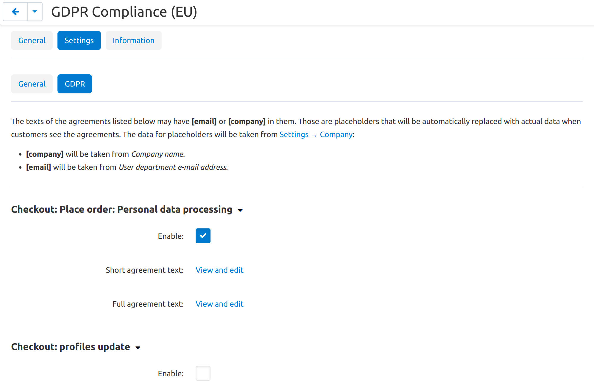

**************************************
How To: Use the GDPR Compliance Add-on
**************************************

.. contents::
   :backlinks: none
   :local:

========================================
Step 1. Install and Configure the Add-on
========================================

#. In the Administration panel, go to **Add-ons → Manage add-ons**.

#. Switch to the **Browse all available add-ons** tab.

#. Find the **GDPR Compliance (EU)** add-on and click **Install** next to it.

   .. note::

       The add-on first appeared in CS-Cart and Multi-Vendor 4.7.4. Our support staff can offer guidance to those who use older versions; for a small fee we can even adapt the add-on for your store. Please `contact our technical support via Help Desk <https://helpdesk.cs-cart.com>`_ for more information.

   .. image:: img/gdpr-addon.png
       :align: center
       :alt: The GDPR Compliance add-on first appeared in CS-Cart and Multi-Vendor 4.7.4.

#. Once the add-on is installed, click on its name to open the add-on's settings.

#. The **General** tab you'll find the following settings:

   * **Email for personal data issues**—the email address that will be used in the notifications about personal data processing. For example, it could be an email address of the department that handles customers' requests to export or anonymize their data.

   * **Company name**—the company name that will be used in the notifications about personal data processing.

     .. note::

         These settings affect only the notifications about personal data processing, and only if the texts of those notifications include the ``[email]`` and ``[company]`` placeholders respectively. Check Step 2 for more information.

#. Click **Save**.

============================================
Step 2. Check and Update the Privacy Notices
============================================

The add-on's settings have the **GDPR** tab. It contains the list of places where checkboxes for requesting consent will be displayed. For each place, you can choose whether or not you want a checkbox for requesting consent to appear.

Every checkbox for requesting consent is accompanied by a notice about personal data processing. The texts of these notices and checkboxes can be accessed and edited separately from each other. These texts are in fact :doc:`language variables </user_guide/look_and_feel/languages/translate>`, so the same rules apply when you translate or edit them.

We tried our best to make the default personal data processing notices as informative as possible. However, we can't guarantee that they fully comply with the GDPR, especially since the practices regarding personal data differ in every company. That's why we ask you to review and edit these notices as you and your lawyers see fit.

When you edit these notices, you may add ``[email]`` or ``[company]`` placeholders into the texts. When customers see the text, they'll see the email address or company name from the add-on's settings. Change the values in the settings, and you'll update the email address and/or company name in all the notices simultaneously.

.. hint::

    If you don't want the notices to be too long, add a link to your Privacy Policy to all of them, and describe everything in the Privacy Policy. However, we can't guarantee that this practice is GDPR-compliant, so you'd have to consult your lawyer regarding this.

================================
Step 3. See How the Add-on Works
================================

#. Check the storefront. Make sure that the notices about personal data processing appear in every place where you collect personal data.

   .. image:: img/gdpr-storefront.png
       :align: center
       :alt: A notification about personal data processing on the storefront.

   For example, the add-on **doesn't** automatically add notifications about personal data processing to :doc:`forms created with Form Builder </user_guide/addons/form_builder/create_form>`. That's because the checkbox can be created via the Form Builder itself.

   In that case the consent for personal data processing won't be stored in the database, but rather in an email you receive, alongside the data that the customer may've provided via the form.

#. Test the workflow of granting consent. Register as a new customer and give consent for personal data processing in various places. 

#. Open your database to see the consent logs in the ``cscart_gdpr_user_agreements`` table.

   .. image:: img/gdpr-database.png
       :align: center
       :alt: A table in the database that stores customers' consent for personal data processing.

#. As an administrator, try :doc:`exporting personal data and anonymizing a customer </user_guide/users/customers/gdpr>`.

   .. note::

       Customers would have to contact you to request their personal data or anonymization. For example, they can do it via email that you provide in the notices about personal data processing in step 2.

   .. image:: img/gdpr-user.png
       :align: center
       :alt: The personal data of a user in the admin panel.

======================================
Step 4. Make Sure You Comply with GDPR
======================================

**The add-on by itself won't make you GDPR-compliant.** We recommend `familiarizing yourself with the GDPR <http://eur-lex.europa.eu/legal-content/EN/TXT/?uri=uriserv:OJ.L_.2016.119.01.0001.01.ENG&toc=OJ:L:2016:119:TOC>`_ and looking into other measures that you may need to take.

For example, you may want to review and update your legal documents to address the requirements of the GDPR. For your online store, those documents could be:

* **Privacy Policy.** It exists by default under **Website → Pages** in the Administration panel, unless you have deleted it. You can edit it like any other content page in your store.

* **Terms of Service.** They appear at checkout if you *ask customers to agree to terms & conditions during checkout* under **Settings → Checkout**. The text can be edited under **Administration → Languages → Translations** in the following language variable: ``terms_and_conditions_content``.
