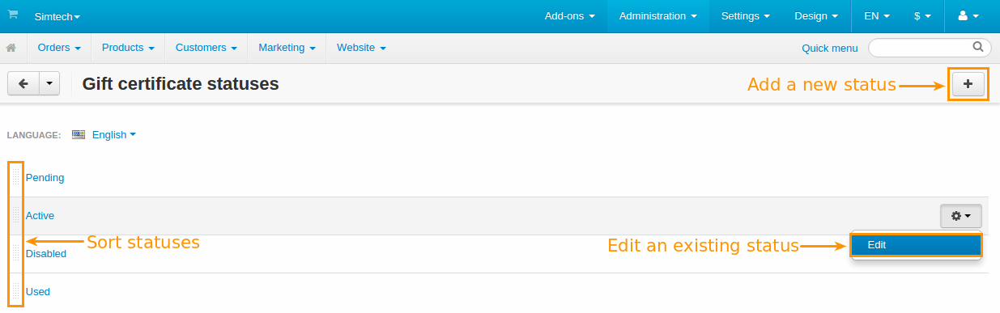

****************************************
How To: Manage Gift Certificate Statuses
****************************************

==================================
The Gift Certificate Statuses Page
==================================

Every gift certificate has a status assigned to it. To see the list of available statuses, go to **Administration → Gift certificate statuses**.

.. hint::

   You can also go to **Marketing → Gift certificates**, click the gear button in the upper right part of the page, and choose **Gift certificate statuses**.

.. image:: img/open_gc_status_page.png
    :align: center
    :alt: Going to the list of available gift certificate statuses in CS-Cart.

Here's what you can do on the list of the gift certificate statuses:

* Create a new status by clicking the **+** button.

* Edit an existing status by clicking its name.

* Drag & drop the statuses to sort them.

By default, there are four possible gift certificate statuses:

* **Active**—the certificate can be applied.

* **Disabled**—the certificate has been disabled by the store administrator.

* **Pending**—the certificate was created, but hasn't been activated yet.

* **Used**—the gift certificate has been used, and all the money assigned to that certificate has been spent.

=============================
Add Gift Certificate Statuses
=============================

To add a custom gift certificate status:

#. Click the **+** button and choose **Add status** from the drop-down menu. This will open a pop-up window with a form for the new status details.

   .. image:: img/add_gc_status.png
       :align: center
       :alt: Click the plus button and choose "Add status" on the gift certificate status page.

#. Fill out the form. Fields marked with ***** are mandatory.

   * **Name***—the name of the status.

   * **E-mail subject**—the subject of an email message that is sent to customers automatically when the gift certificate status changes to this status.

   * **E-mail header**—the header of an email message that is sent to customers automatically when the gift certificate status changes to this status.

   * **Notify customer**—if you tick this checkbox, the customer receives an automatic email notification when the gift certificate status changes to this status.

#. Click the **Create** button.
