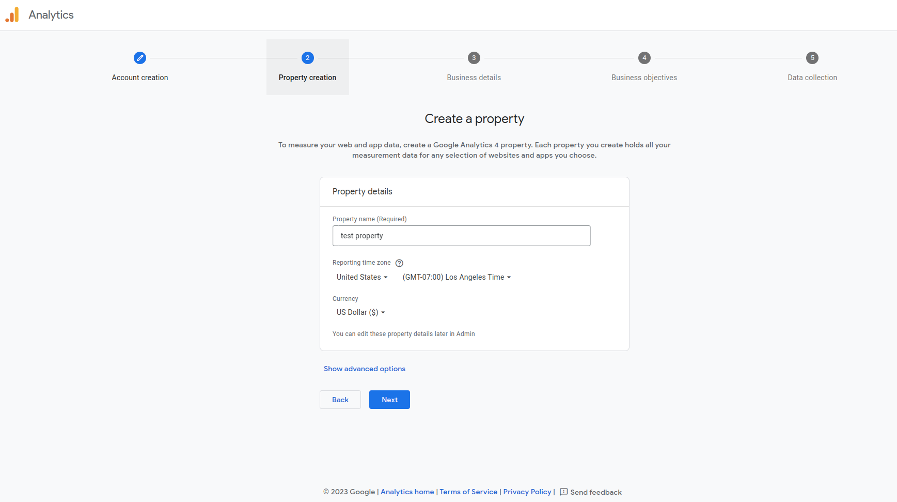
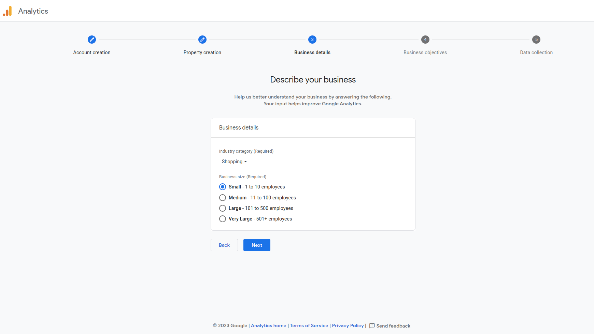
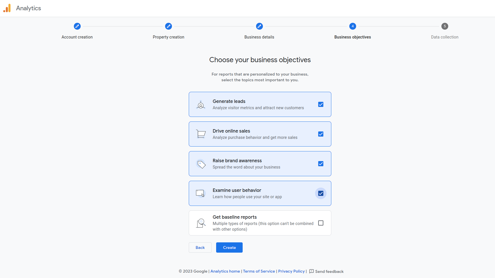
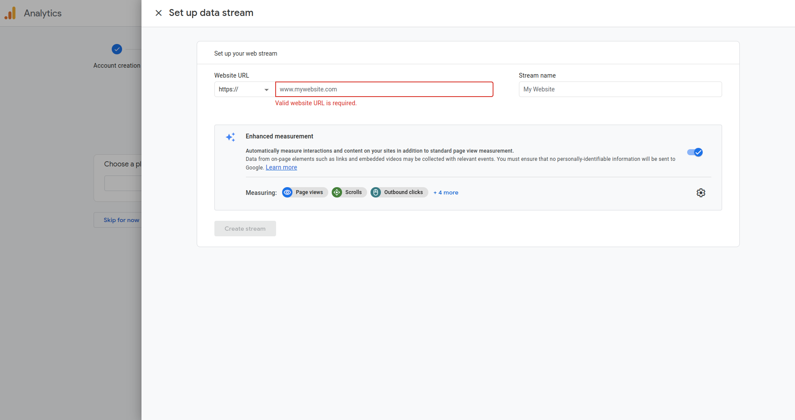
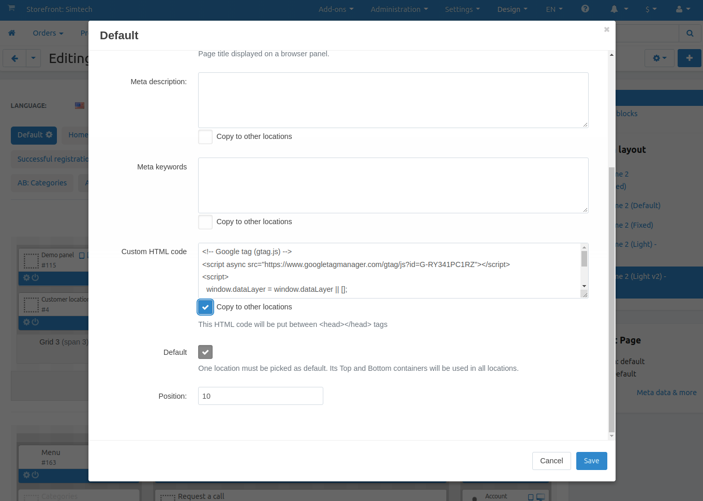

******************************************
How To: Set up the Google Analytics add-on
******************************************
.. note ::

	The support of Google Analytics 4 was added in version 4.12.2.

The **Google Analytics** add-on is created in order to allow the administrator to see the statistics for CS-Cart on his Google account. This add-on is based on `Universal Analytics <https://support.google.com/analytics/answer/2790010?hl=en>`_.

.. contents::
   :backlinks: none
   :local:

======================================
Setting up the Google Analytics Add-on
======================================

*   In the Administration panel, go to **Add-ons → Manage add-ons** and enable the **Google Analytics** add-on (change its status to *Active* in the select box on the right).
*   Click on the name of the add-on.
*   Enter the **Universal Analytics** account number into the **Google Analytics account number** field.
*   Click **Save**.

-----------------------------------------------
How To Create Your Own Google Analytics Account
-----------------------------------------------

Log in to your Google account and go to the `Google Analytics <http://www.google.com/analytics>`_ page. Click the **Get started today** button and follow the given instructions.

**Step 1.** Enter the name of the new Google Analytics in the Account name field and tick the Account Data Sharing Settings checkbox.

.. image:: img/step_1.png
    :align: center
    :alt: Step 1
    
**Step 2.** Create a Google Analytics 4 Property. Each property you create holds all your measurement data for any selection of websites and apps you choose.

**Step 3.** Choose an industry category of your business and its size. 

    
**Step 4.** Choose the most relevant topics to track.

**Step 5.** Choose a platform for wich you will collect data: a website, an Android app or an iOS app. You can skip this step by clicking the **Skip for now** button and edit it later. After that you will be suggested to enter your app data:

.. image:: img/Analytics_setup_app.png
    :align: center
    :alt: Step 5
    
For the website, enter the websie address and a Steram name. Then click the Create stream button and you will be suggested to add the Google Tag to all your website pages. On how to do this, we will touch on this topic below.  

.. image:: img/step_5_gtag.png
    :align: center
    :alt: Step 5
    
If it is Android or iOS apps, you will need to enter your Firebase project data and follow the given instarctions. They are both similar for the Android and iOS apps.

    
------------------------------------------   
How To Add Google Tag To All Website Pages
------------------------------------------

For example, you choose a website platform in the Step 5, enter your website address and a stream name. Now you need to copy and paste the Google Tag code to all of your website pages to track all of your chosen metrics. 

*   In the Admin panel, go to  **Design - Layouts** page. Find the **Default** layout page and click on the gear icon by its name. 

.. image:: img/design_4.png
    :align: center
    :alt: Design

*   Copy the Google Tag and paste it to the **Custom HTML code** field.

*   Tick the **Copy to all pages** checkbox. 
*   Click **Save**.

After that, it should take some time for metrics to start being tracked in Google Analytics.
