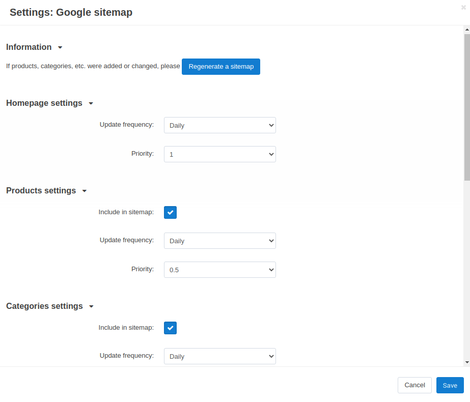

****************************************
How To: Set up the Google Sitemap Add-on
****************************************

The :doc:`/user_guide/addons/google_sitemap/index` add-on generates the XML site map, which makes website indexing easier for Google (and other search engines). A site map allows search robots to define the location of website pages, the time of their last update and its frequency in order to index the website more effectively. This is especially important for big stores with a large number of pages.

To set up the **Google sitemap** add-on:

#. In the Administration panel, go to **Add-ons → Manage add-ons** and make sure the **Google sitemap** add-on has an *Active* status.

#. Click on the name of the add-on.

#. Tick the checkboxes of those settings that you want to include in the sitemap (except the **Homepage settings**, because it is included by default).

#. In the **Update frequency** drop-down list select the desired update frequency.

#. In the **Priority** drop-down list select the desired priority.

   .. note ::

	   These options can be set up for the following entries: **Homepage settings**, **Products settings**, **Categories settings**, **Pages settings**, **Brand/Manufacturer feature pages settings**, **Companies settings**. 

#. Click **Save**.

.. note ::

	If products, categories, etc. were added or changed, click the **Regenerate a sitemap** button on the settings page of the **Google sitemap** add-on to regenerate the xml sitemap.

Sitemap can be reached by the URL http://www.domain.com/sitemap.xml if :doc:`/user_guide/addons/seo/index` add-on is enabled. If it is disabled, you need to add the following code to the *.htaccess* file to get this URL working: 

``RewriteRule ^sitemap\.xml$ ./index.php?dispatch=xmlsitemap.view [L]``. 

Add this line after the ``# RewriteBase /`` line.
