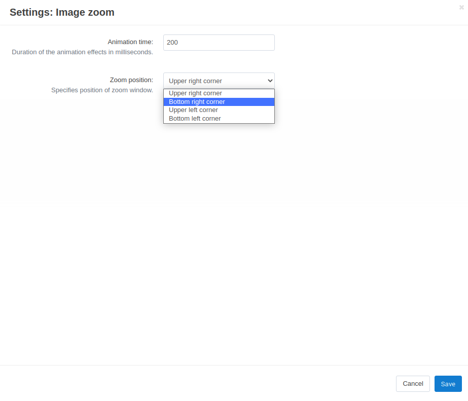

**************************
Image Zoom Add-on Settings
**************************

*	**Opacity** - Opacity of tint for the product picture. Define any value between 0 and 1. If 0, no tint will be visible.
*	**Animation time** - Duration of the animation effects in milliseconds. The more the value, the slower the zoom picture appears on the screen.
*	**Color** - Color to use for the tint effect.

.. note ::

	Color must be defined as hexadecimal HTML color from *#000000* for black to *#FFFFFF* for white.

*	**Zoom position** - Specifies position of zoom window. Numeric (0-15) positions are relative to page image as shown by the following key (blue squares represent zoom window):

*	**Zoom size mode** - Defines the rule for sizing the zoom window and lens: *Image* - Zoom window will match small image; *Lens* - CSS of lens (.cloudzoom-lens) has priority, zoom window will be adjusted; *Zoom* - CSS of zoom window (.cloudzoom-zoom) has priority, lens will be adjusted; *Full* - Zoom window will maximise to full size of zoom image.
*	**Caption position** - Position of the image caption: *Top* or *Bottom*.
*	**Ease time** - Number of milliseconds of mouse easing movement of zoom image. The bigger the number, the more easing. Zero means no easing.
*	**Zoom fly out** - If selected, the flying zoom animation is enabled.