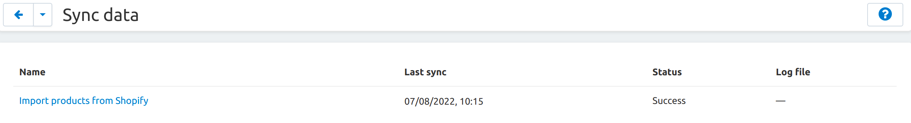
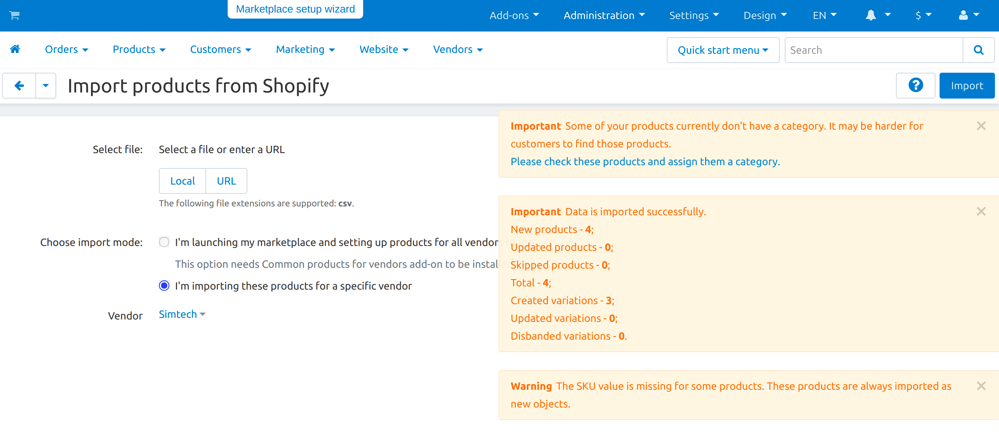

*******************
Import from Shopify
*******************

.. note:: 

    This add-on is available in CS-Cart and Multi-Vendor starting from the version 4.15.1.

`Shopify <https://www.shopify.com/>`_ is a platform for starting an online e-commerce business. With the "Import from Shopify" add-on store owners transfer their product base (including features, variations, images) from Shopify to CS-Cart. For the new vendors this add-on is a quick way to place their products on your platform.

Functionality
================

:doc:`Install the "Import from Shopify" add-on in the admin panel </user_guide/addons/1manage_addons>`. To start importing products from Shopify, go to **Administration → Sync data** and choose "Import products from Shopify". Admins and vendors upload their csv-formanted export files from Shopify on this page. Here you can also find out the date of the last sync and whether it was successful.

Select a file or enter its url and click **Import**. After successful data importing, you will see how many new products/variations have been loaded. Shopify and CS-Cart differ in the meaning of some entities, including categories. So all the products imported from Shopify are the "products without category". In these cases CS-Cart creates such a category automatically.

Multi-Vendor owners additionally choose the import mode:

* Import all products at once—convenient for those who are just launching their marketplace. Imported products become the common ones, so the mode is available when the :doc:`/user_guide/addons/common_products/index` add-on is enabled.

* Import products for a specific vendor. Administrators import entities that they could have created for vendors manually, such as products, features, options, etc.

Vendors can create their own features when importing from Shopify if the administrator has allowed vendors to do it on the **Settings → Vendors** page.

