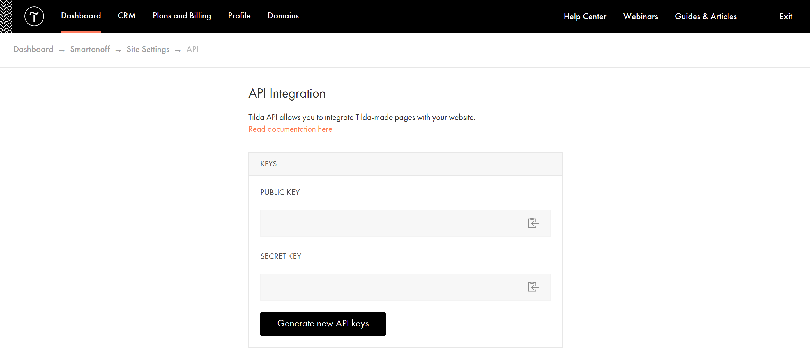
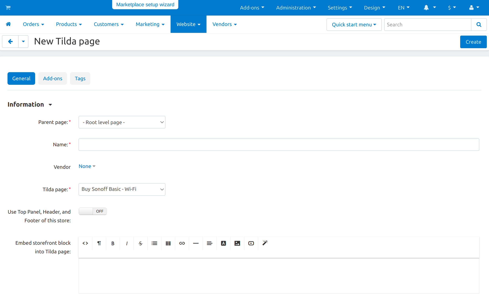
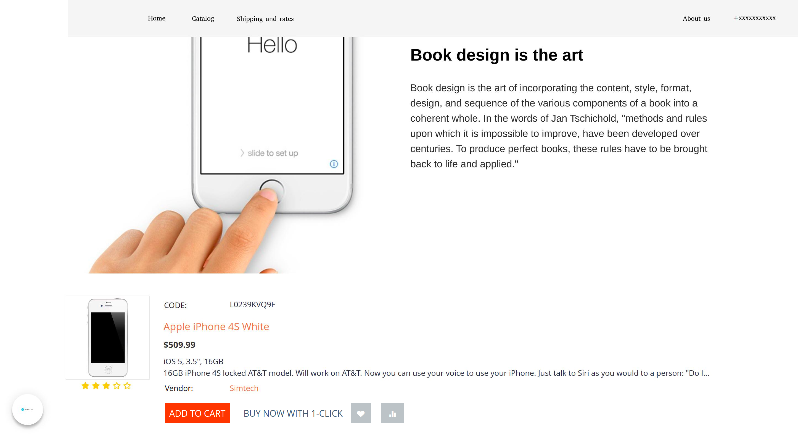

************************    
Landing Pages From Tilda
************************

.. note:: 

    This add-on is available in CS-Cart and Multi-Vendor starting from the version 4.14.1. You must have a Tilda account with "Business" plan connected.

With Tilda, you can quickly create customized landing pages for different audiences. The add-on allows you to integrate pages created in Tilda into CS-Cart, and you will be able to fill your store with content faster and easier. Here's what you can do:

* add pages created in Tilda to the store;

* replace existing pages with pages from Tilda;

* show blocks from the store on Tilda pages.

.. contents::
    :backlinks: none
    :local:

Installation and Configuration
==============================

Install the add-on just :doc:`like any other add-on </user_guide/addons/1manage_addons>`. Click on the name of the installed add-on to open its settings:

**Public API key**, **Secret API key.** Use the keys from your personal Tilda account to connect Tilda to CS-Cart.

#. Go to the **Dashboard** and open the required project.

#. Open **Site Settings → Export → API integration** and copy the API keys.

#. Paste them into the corresponding fields in CS-Cart. Click **Save**.

.. _project:

**Project**. The setting appears after entering the API keys. If you entered the correct keys, a drop-down list with all your Tilda projects will appear in the **Project** field. Select the project which pages will be integrated into the store, then **Save** the settings.

Functionality
=============

Adding a New Page from Tilda
----------------------------

Add functional Tilda pages with modern design to your CS-Cart store. For example, you can quickly fill your store with selling product pages in one style. To add a page from Tilda to the store:

#. In your admin panel, go to **Website → Pages**. In the upper right corner, click **+** and select **Add Tilda Page**.

#. Set :doc:`CS-Cart page properties </user_guide/website/pages/page_properties>` and fill in the :ref:`additional fields <fields>`.

#. Click **Save**. Now the Tilda page is integrated into your CS-Cart store.

.. _fields:

Additional fields that appear when working with Tilda pages in CS-Cart:

**Tilda page**—choose the base for the new page from the Tilda pages of the selected :ref:`project <project>`.

**Use Top Panel, Header, and Footer of this store**—determine which part of the page layout to replace with the Tilda page.

#. If you enable the setting, then the page from Tilda will be shown only as the main content. At the same time, the page will have the CS-Cart top panel, header and footer. For example, you can leave the language switch, list of categories and contacts from the current store and display your products using the Tilda styles.

#. If you turn off the setting, the Tilda page will replace the entire layout page. For example, you can use a page from Tilda as your homepage. In this case, there should be product catalog, contacts and other attributes of the home page on the page from Tilda.

After the administrator is done with the settings, they will be able to see which part of the layout page has been replaced with the Tilda page. The corresponding note that Tilda page is used instead of the layout content or part of will be there.

**Embed storefront block into Tilda page**—select a :doc:`CS-Cart block </user_guide/look_and_feel/layouts/blocks/index>` that will appear on the Tilda page.

**Published**—the date when the page was last updated on the Tilda side.

Replacing an Existing Page with a Page from Tilda
-------------------------------------------------

You don't have to create a new page to add a page from Tilda to your store. You can replace the existing page in the store with a page from Tilda.

For example, this can help to make the right impression on your website visitors and increase conversions. Turning your homepage into a landing page may help turn the visitors into your customers. To do this:

#. Go to **Design → Layouts** in the admin panel.

#. Replace the existing layout page with a page from Tilda in any convenient way: using the page settings or the right sidebar.

   .. note:: 

       Use the right sidebar for easier navigation between the layout pages. It contains the basic information about the page—its dispatch and name. There is a **Meta data & more** button below that opens the window for editing layout pages.

#. In the opened window, tick the **Use Tilda page** checkbox and select the page that replace the old content.

#. Configure the :ref:`additional fields <fields>`. 

#. Click **Save**. Additional information will appear in the sidebar with the title of the Tilda page.

#. Now the content of the store page will be replaced with the page from Tilda.

   .. image:: img/change_layout_page.png
       :align: center
       :alt: Layout page when the Tilda page is used.

Displaying a Block from a Storefront on a Tilda Page
----------------------------------------------------

You can integrate a page created in Tilda into your store and fill it with function elements—CS-Cart blocks. For example, you can add a block with the Buy button to a product page created in Tilda.

To do this, while creating/editing the page in the admin panel, in the **Embed storefront block into Tilda page** field:

1. Click the **Block Management** icon |block_manager| in the visual editor and select the block that will be shown on the Tilda page.

.. |block_manager| image:: img/block_manager.png

2. Switch the editor to HTML mode by clicking  **< >** and copy the generated code.

3. Go to your personal account on the Tilda website and open the necessary page.

4. Click **+** and add a block. In the opened list, select **Other → HTML code**.

5. Click the **Content** button |content| and paste the generated code into the opened window.

6. Click **Save and close**, then **Publish**.  Now the block from the store will appear on the Tilda page.

A page created in Tilda with an added product block might look like this:

Synchronization
===============

When you save a page or layout on the CS-Cart side, the data is synchronized. So, if you want the changes made in Tilda to appear, publish them first and save the page in CS-Cart after that. Update the storefront that contains the Tilda page.

The add-on allows you to configure automatic synchronization of Tilda and CS-Cart pages. Auto synchronization reduces the number of steps you need to make changes to your Tilda pages. Once published, your changes appear immediately in the store. To set up the auto synchronization:

#. Open the add-on settings and copy the store link.

#. In your Tilda personal account, go to the **My websites & campaigns** page and open the project you need.

#. Open **Site Settings → Export → API integration** and scroll down to the bottom of the page.

#. Paste the copied address to the Webhook block and click **Save Webhook**.

This way you won’t have to save the page in CS-Cart every time after making changes in Tilda.
