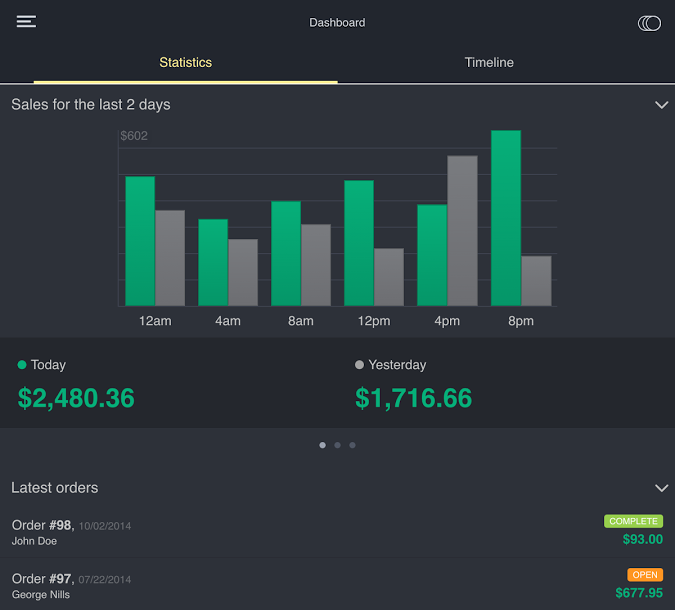

****************
Mobile Admin App
****************

.. note::

    Starting with version 4.7.3, we recommend using the **Responsive Admin Panel [Beta]** add-on that also comes with the distribution. That's why we no longer include the **Mobile Admin App** add-on in new installations (those who upgrade from older versions still have it).

**Mobile Admin App** connects your store to our mobile app that you can later download and use to manage your store. The app is available for Android and iOS devices.

.. toctree::
    :maxdepth: 2
    :titlesonly:
    :glob:

    set_up_admin_app
