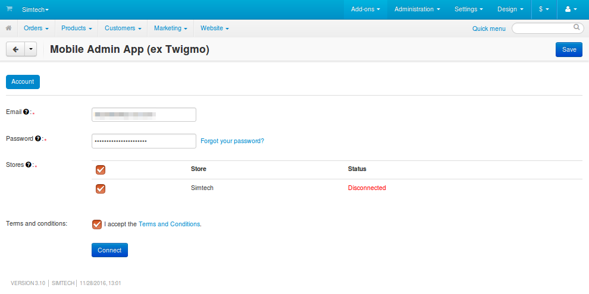
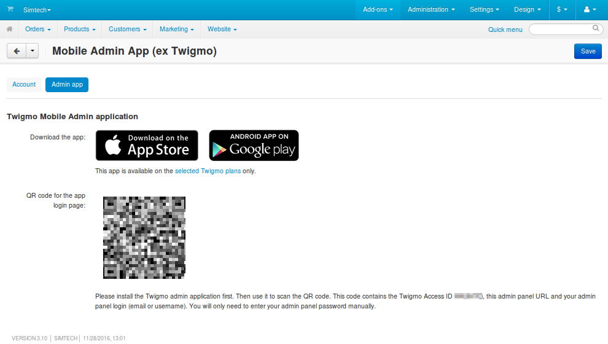
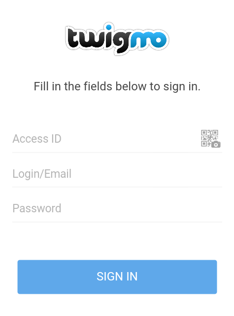

**********************************************
How To: Set up Mobile Admin App for Your Store
**********************************************

.. note::

    **Mobile Admin App** can be used only with **CS-Cart Ultimate/Multi-Vendor 4.4.2 and higher**.

==============================================
Step 1. Connect Your Store to Mobile Admin App
==============================================

1.1. In the Administration panel, go to **Add-ons → Manage add-ons**.

1.2. Find the **Mobile Admin App** add-on.

1.3. Click on the name of the add-on to open the settings.

1.4. **Mobile Admin App** requires the credentials of your Twigmo account:
 
     * **E-mail**—the email address of your Twigmo account.

     * **Password**—the password of your Twigmo account.

     .. note::

         If an account with the specified credentials doesn’t exist, it will be created automatically.

1.5. Choose the stores that will be connected to the app.

1.6. Read the `Terms and conditions <http://www.twigmo.com/terms/>`_ and tick the **I accept the Terms and Conditions** checkbox.

1.7. Click **Connect**.

     .. important::

         If you create a new Twigmo account, please check the inbox of the specified e-mail address after connecting your store. There should be a confirmation letter from Twigmo.

====================================
Step 2. Download and Install the App
====================================

2.1. After you configure the add-on, a new tab called **Admin app** will appear in the add-on’s settings. Switch to that tab.

2.2. Use one of the links to get the **Twigmo Admin** app for your mobile device:

     * `App for Android. <http://play.google.com/store/apps/details?id=com.simtech.twigmoAdmin>`_

     * `App for iOS. <http://itunes.apple.com/us/app/twigmo-admin-2.0/id895364611>`_

.. important::

    Starting with version 4.4.2, those who use **CS-Cart Ultimate** and **Multi-Vendor** have their own free Twigmo plan that allows them to use **Mobile Admin App**.

==========================================
Step 3. Sign in to Your Store with the App
==========================================

The **Twigmo Admin** app offers two ways to log in:

* Scan the QR code from the **Admin app** tab in the **Mobile Admin App** add-on settings. This will take you to the authorization form with most of the fields already filled in. You’ll only need to enter the password for your administrator account.

* If you can’t use the QR code, you’ll have to enter your credentials manually:

  * **Access ID**—the Twigmo Access ID of your store. You can find it in the settings of the **Mobile Admin App** add-on.

  * **Email**—the email of your administrator account in your store.

  * **Password**—the password of your administrator account.

.. important::

    Enter the credentials of your administrator account from your store, **NOT** the credentials of your **Twigmo** account.

After that just click **Sign in**, and you'll be able to manage your store.

