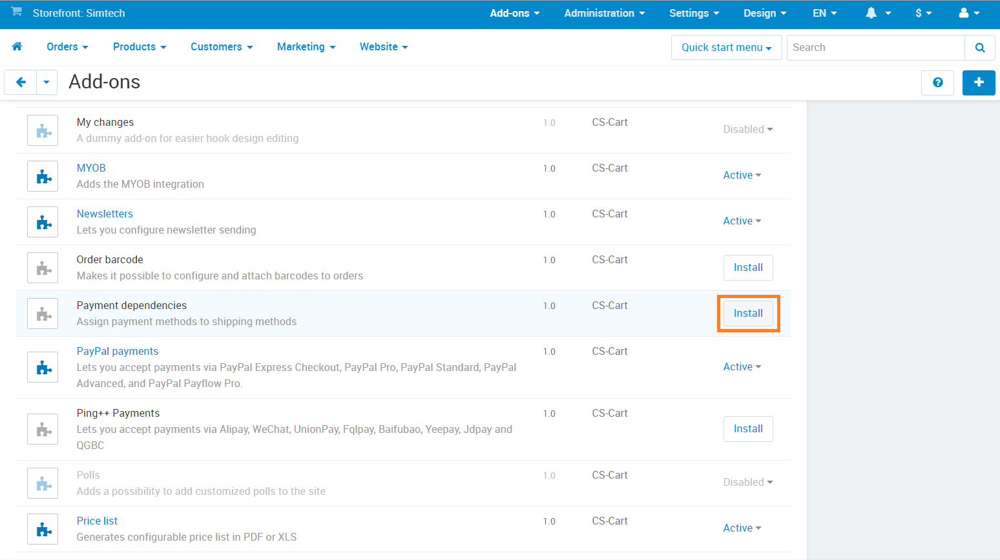
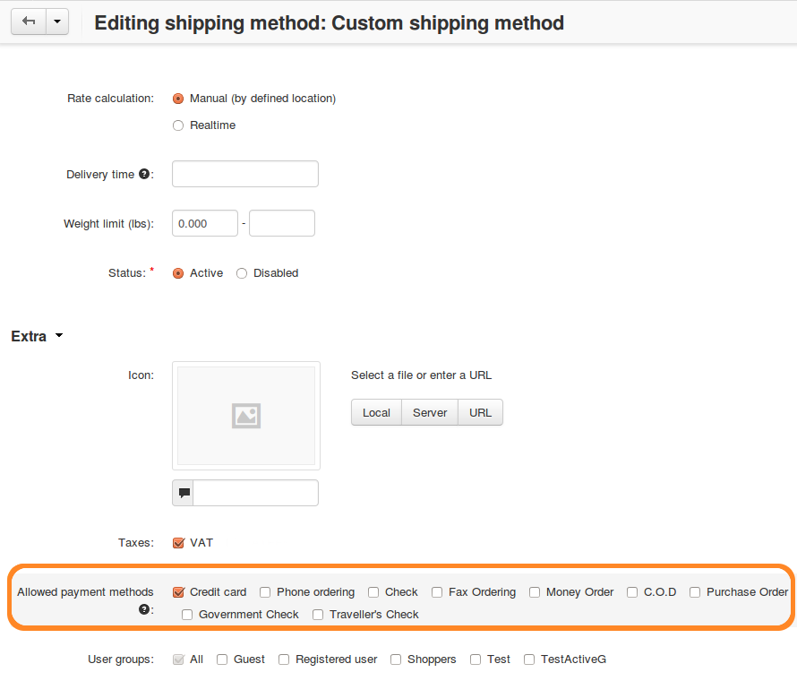

********************
Payment Dependencies
********************

The **Payment Dependencies** add-on allows you to :doc:`assign payment methods to shipping methods <../../shipping_and_taxes/shipping_methods/create_payment_dependencies>`. This add-on doesn’t have any settings—install it, and you’re good to go.

============
Installation
============

1. Open the Administration panel of your store.
2. Go to **Add-ons → Manage add-ons**.
3. Find the add-on, and click the **Install** button. The add-on will be activated automatically.

========================
Changes in the Interface
========================

Once you install the add-on, go to **Administration → Shipping & taxes → Shipping methods** and click the name of any shipping method to edit it. In the **Availability** section of the **General** tab you will see the checkboxes named after all the payment methods that exist in your store.

Tick the checkboxes of the payment methods you want to allow for the chosen shipping method, then save your changes.

