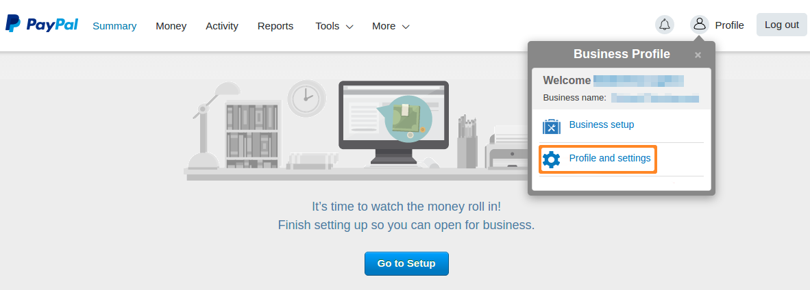
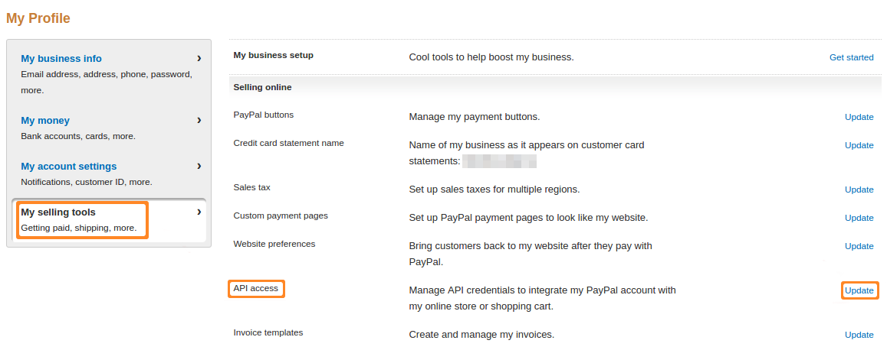
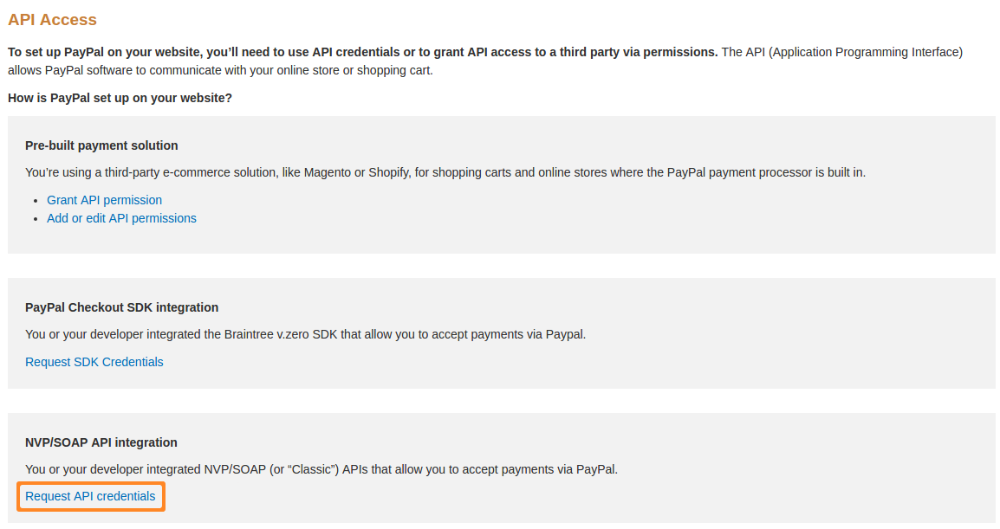
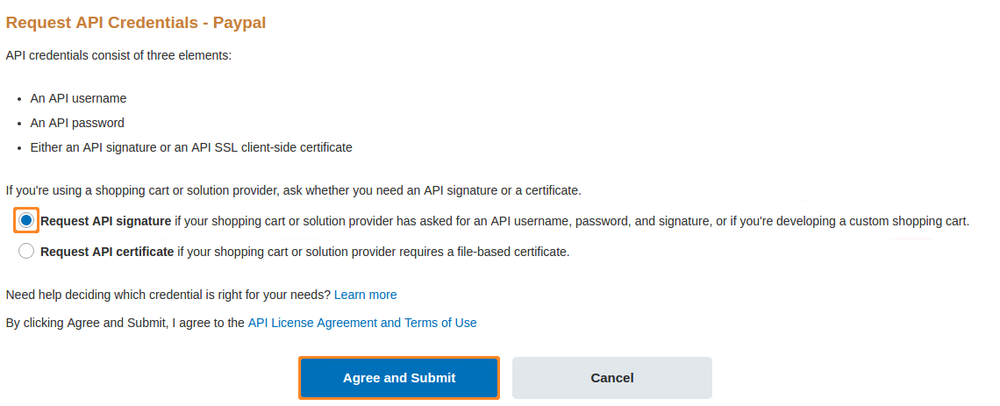
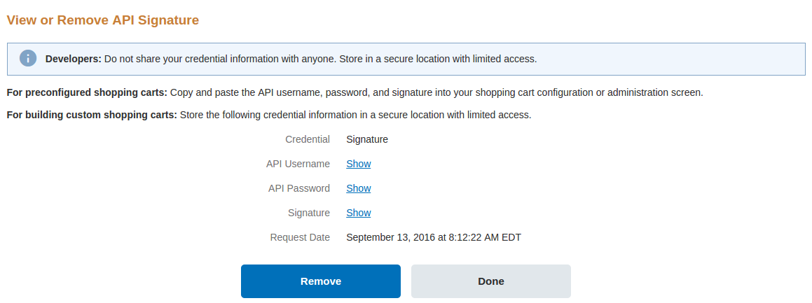
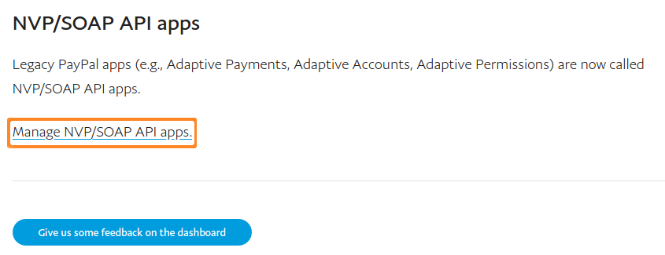
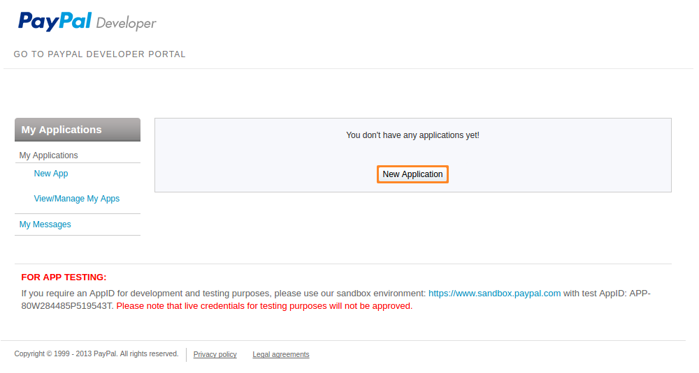

****************************************************
How To: Get Credentials for PayPal Adaptive Payments
****************************************************

When you :doc:`create a payment method that uses PayPal Adaptive Payments </user_guide/payment_methods/paypal_adaptive_payments>`, you'll need to get API username, API password, Signature, and Application ID from the PayPal website.

.. note::

    You can also refer to `PayPal Developer documentation <https://developer.paypal.com/docs/classic/lifecycle/goingLive/>`_ to learn more about getting these credentials. Please note that you'll need credentials for an NVP/SOAP API app.

=============================================
Getting API username, API password, Signature
=============================================

1. Log in to your PayPal Business account on `the PayPal website <https://www.paypal.com/>`_.

2. Open the settings of your profile.

3. Select the **My selling tools** section on the left. Find **API access** on the list of settings and click the **Update** link to the right of it.

4. A new page will open. While on that page, click **Request API credentials**.

5. Choose **Request API signature** and submit your request.

6. You'll be able to see your API username, API password, and signature by clicking the **Show** links next to them.

======================
Getting Application ID
======================

.. important::

    The more detailed and accurate information you provide when applying for **Application ID**, the easier it will be for PayPal specialists to check your store.

1. Log in to the `PayPal Developer website <https://developer.paypal.com/>`_ using the credentials of the PayPal account registered to the application owner.

2. Go to the `My Applications <https://developer.paypal.com/developer/applications/>`_ page.

3. Go to the **NVP/SOAP API apps** section and click **Manage NVP/SOAP API apps**.

4. A new page will open. Click the **New application** button there.

5. The application form will appear. Start filling it in.

7. When you reach the **Services used by app** step:

 * Tick the **Basic Payments** checkbox and all its checkboxes, except for **Implicit Send Money** and **Refunds or Chargebacks**.

   .. image:: img/paypal_basic_payments.png
        :align: center
        :alt: Selecting which functionality of Basic Payments your store will use.

 * Tick the **Chained Payments** checkbox and select **Instant** payments to secondary receivers. When answering who pays the fees, select either **Each receiver** or **Primary receiver**; the add-on doesn't support the **Secondary receiver** variant.

   .. image:: img/paypal_chained_payments.png
        :align: center
        :alt: Selecting how Chained Payments will be handled.

8. Fill in the remaining fields in the form and click **Submit app**.
