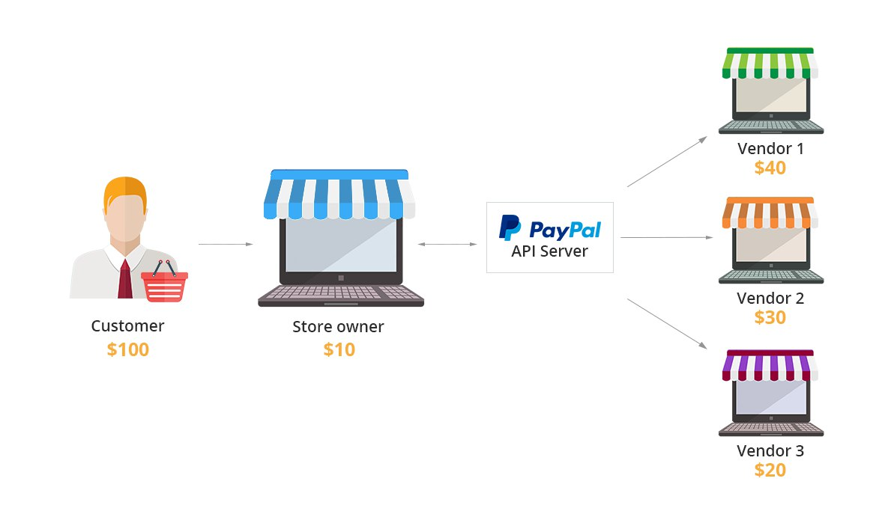

***********************
PayPal for Marketplaces
***********************

.. note::

    This add-on comes with Multi-Vendor 4.8.1 and newer versions.

By default, :doc:`all the money from orders in Multi-Vendor goes to marketplace owner </user_guide/users/vendors/workflow>`. The :doc:`Accounting </user_guide/users/vendors/account_balance>` page helps to manage money afterwards: vendors receive money on their balance (except for the transaction fees specified in their :doc:`vendor plans </user_guide/addons/vendor_plans/index>`) and can :ref:`request the withdrawal of that money <withdrawal>` later. This approach adds work for marketplace owners, who have to figure out how to transfer the requested money to vendors.

The **PayPal for Marketplaces** add-on addresses that problem: customers still make one payment when they order products from multiple vendors, but the vendors' share ends up on the vendors' respective PayPal Business accounts. The transaction fees from vendor plans are withdrawn in favor of the marketplace owners automatically, and there is also an option of collecting unpaid :ref:`payouts <payout>` (such as periodic fees for using vendor plans) from vendors' share in the order.

========================================
Advantages over PayPal Adaptive Payments
========================================

Previously, Multi-Vendor had another solution from PayPal called Adaptive Payments. PayPal `disabled sign-ups for Adaptive Payments <https://www.paypal-community.com/t5/Adaptive-Payments-Accounts/PayPal-Apps-com-will-be-permanently-unavailable-starting/m-p/1357320>`_ on December 1, 2017. We encourage new Multi-Vendor users to use **PayPal for Marketplaces** instead; this add-on is better than Adaptive Payments in a couple of ways.

* With Adaptive Payments, the payment process could be split into multiple steps at checkout when items were being bought from more than 5 vendors. PayPal for Marketplaces no longer has that problem.

* PayPal Adaptive Payments wasn't integrated with the :doc:`RMA </user_guide/addons/rma/index>` add-on, so refunds had to be done on the PayPal side. PayPal for Marketplaces allows marketplace owners to make a refund right from Multi-Vendor admin panel. The money for the refund will be taken from the vendor.

  .. image:: img/paypal_for_marketplaces_refund.png
      :align: center
      :alt: The distribution of money via PayPal for Marketplaces.

=========================================
How To: Configure PayPal for Marketplaces
=========================================

Setting up PayPal for Marketplaces in Multi-Vendor takes multiple steps:

* Installing and configuring the add-on (that's what we'll describe below).

* Applying for PayPal for Marketplaces (check out `this article by PayPal <https://www.paypal.com/gb/smarthelp/article/what-is-paypal-for-marketplaces-ts2122>`_).

* Configuring the payment method and having your vendors connect their PayPal Business accounts (we'll describe it :doc:`in a separate article </user_guide/payment_methods/paypal_for_marketplaces>`).

Let's start with setting up the add-on itself:

#. Go to **Add-ons → Manage add-ons** in the administration panel.

#. Switch to the **Browse all available add-ons** tab.

#. Find **PayPal for Marketplaces** and click **Install** next to it.

   .. image:: img/paypal_for_marketplaces.png
       :align: center
       :alt: The PayPal for Marketplaces add-on in CS-Cart Multi-Vendor.

#. Once the add-on is installed, click on its name to open the add-on's settings. It only has one setting that is described below

   **Commission includes**—determines how the money from orders will be diverted to the marketplace owner. There are 2 ways:

   * **Order commission**—when an order is paid, the commissions :doc:`specified via the Vendor Plans add-on </user_guide/users/vendors/manage_vendor_plans>` will be deposited in the marketplace owner's account automatically. The remaining money will be distributed among vendors, and completed :ref:`withdrawals <withdrawal>` will be created for vendors automatically. Any unpaid :ref:`payouts <payout>` (such as periodic fees for using vendor plans) will be ignored.

   * **Order commission and unpaid payouts**—when an order is paid, the commissions :doc:`specified via the Vendor Plans add-on </user_guide/users/vendors/manage_vendor_plans>` will be deposited in the marketplace owner's account automatically.

     If a vendor owes the marketplace a certain sum (for example, an unpaid periodic fee), that sum will be taken from the vendor's share in the order and diverted to the marketplace owner's account as well.

     .. important:: 

         If the vendor's share in the order can cover all of the vendor's pending :ref:`payouts <payout>`, those payouts will be marked as *Completed*. Otherwise they'll remain with the *Pending* status until the remaining debt is covered by one of the next orders.

     After that, if the vendor's share has any sum of money left, it will be deposited in the vendor's account and recorded as a completed :ref:`withdrawal <withdrawal>`.

  .. image:: img/paypal_for_marketplaces_settings.png
      :align: center
      :alt: The settings of the PayPal for Marketplaces add-on.

#. Once you've chosen whether or not you want to collect unpaid payouts with the aid of PayPal for Marketplaces, click **Save**.

#. :doc:`Set up a payment method that uses PayPal for Marketplaces. </user_guide/payment_methods/paypal_for_marketplaces>`

================
Related Articles
================

* :doc:`/user_guide/payment_methods/paypal_for_marketplaces`
