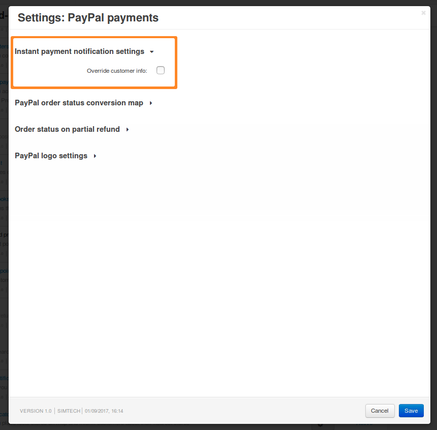
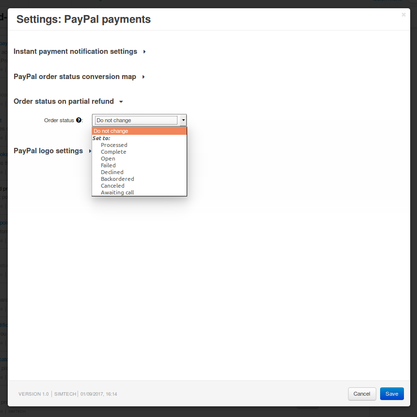
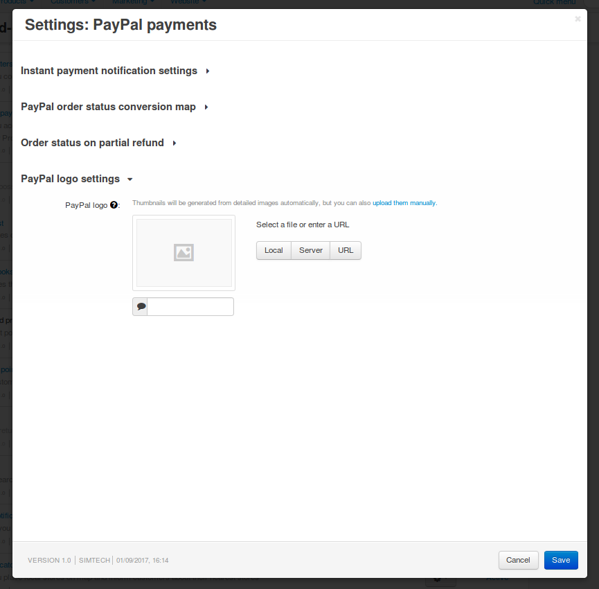

***************
PayPal Payments
***************

With this add-on you can accept payments via PayPal Express Checkout, PayPal Pro, PayPal Standard, PayPal Advanced, and PayPal Payflow Pro. After you install the add-on, you'll be able to select one of the new payment processors when you :doc:`configure a payment method. <../../payment_methods/adding_payment>`

.. image:: img/paypal_payments.png
	:align: center
	:alt: PayPal Payments

======================
Configuring the Add-on
======================

To configure the add-on, go to **Add-ons → Manage add-ons**, find the **PayPal payments** add-on and click on its name. The add-on's settings are grouped under multiple sections.

-------------------------------------
Instant Payment Notification Settings
-------------------------------------

* **Override customer info**—tick this checkbox, if you want to replace customer information in the order details with the data sent by PayPal via :doc:`Instant Payment Notifications. <paypal_ipn>`

  .. hint::

      Instant Payment Notification (IPN) is a service that automatically notifies merchants of events related to PayPal transactions.

----------------------------------
PayPal Order Status Conversion Map
----------------------------------

When a customer places an order and chooses PayPal as the payment method, the order gets the **Open** status. PayPal then sends Instant Payment Notification messages that include the transaction status. The transaction status changes the order status in your store according to the status conversion map.

You can choose which status in your store corresponds to each transaction status sent by PayPal via IPN. Just select a corresponding status from the drop-down list.

For example, the following record means that when PayPal sends an IPN that marks the transaction as *Completed*, the corresponding order in your store will get the *Processed* status.

.. image:: img/paypal_status.png
	:align: center
	:alt: Order status conversion map of the PayPal Payments add-on

------------------------------
Order Status on Partial Refund
------------------------------

.. note::

    This functionality wasn't available until version 4.4.1.

Until version 4.4.1, CS-Cart and Multi-Vendor treated partial refunds the same way as full refunds. In both cases the order status was changed according to the status conversion map for the *Refunded* transaction status. By default, that meant that partially refunded orders got marked as *Canceled*.

Starting with version 4.4.1, you can select different statuses for full and partial refunds. You can either select the desired status for partially refunded orders, or disable status change on partial refund.

--------------------
PayPal Logo Settings
--------------------

* **PayPal logo**—an image that will be placed at the top of the cart review area at PayPal side. Use a valid graphics format, such as *.gif*, *.jpg*, or *.png*. Limit the image to 190 pixels wide by 60 pixels high. PayPal crops larger images.

===============
In This Section
===============

.. toctree::
    :maxdepth: 2
    :titlesonly:
    :glob:

    *

=========
Also Read
=========

* :doc:`../../payment_methods/paypal`
* :doc:`../../payment_methods/paypal_express`
* :doc:`../../payment_methods/paypalpro`
