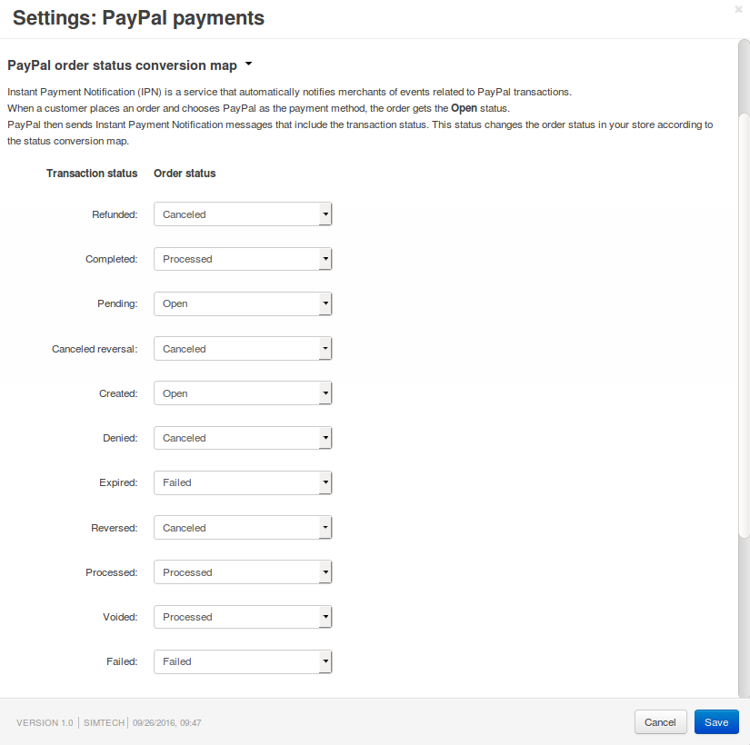
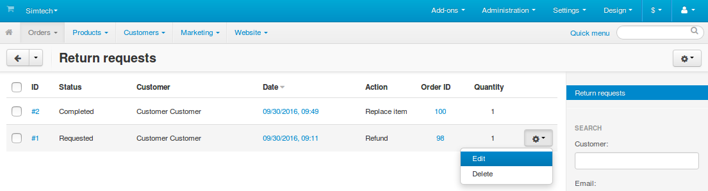
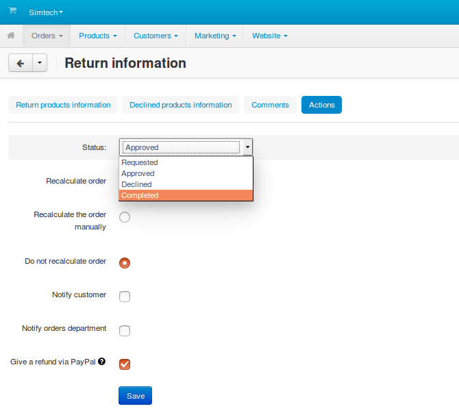

*************************************************
IPNs Explained: How CS-Cart Interacts with PayPal
*************************************************

==========================================
1. What are Instant Payment Notifications?
==========================================

After a transaction-related event, PayPal automatically sends a message. That message is called `Instant Payment Notification (IPN) <https://developer.paypal.com/docs/classic/products/instant-payment-notification/>`_. CS-Cart & Multi-Vendor change the statuses of orders according to transaction statuses that come in IPNs.

Even though you can disable Instant Payment Notifications in your PayPal account, your store will still receive them.

.. important::

    Instant Payment Notifications are the only source of information about PayPal events for CS-Cart/Multi-Vendor and the only way to trigger the automatic change of order statuses.

=====================================
2. How Do IPNs Change Order Statuses?
=====================================

The **PayPal Payments** add-on has an order status conversion map. That map determines, which order status in your store corresponds to each transaction status from IPNs.

To view or edit the map, go to **Add-ons → Manage add-ons**, then find and click **PayPal payments** in the list.

Once the store receives a notification from PayPal, the status of the order is changed according to the map.

============================================================
3. Why Do Some Orders End up with Open or Incomplete Status?
============================================================

Payment methods that use PayPal Express Checkout or PayPal Standard work as follows:

1. A customer clicks the **Submit order** button on the checkout page. At this point we assume that the customer is ready to make the payment, so an order is created in the store.

   If you use :doc:`PayPal Standard </user_guide/payment_methods/paypal>`, you can choose the status that this order will get on creation. Because the order hasn’t been paid for yet, there are two possible initial statuses:

   * **Open**—by default, this status decreases the number of products in stock to reflect that we have put products aside for the customer. That way two customers won't be able to buy the same product while the payment is being processed by PayPal.

   * **Incomplete**—this status ensures that you won't have abandoned unpaid orders with reserved products. But until the response from PayPal (an IPN message) arrives or the customer returns to the store via a link on the PayPal site, the order will be listed as **Incomplete**, and products won't be reserved for that customer.

   .. note::

       If you use **PayPal Express Checkout**, orders will always get the *Incomplete* status initially.

2. The customer is redirected to a PayPal page. Now there are three possible scenarios:

   * **The customer pays for the order successfully.**
 
     In this case order remains **Open** or **Incomplete** until the store receives an IPN from PayPal. The customer doesn’t even have to return to the store via the link on the PayPal page.

   * **The customer uses the link on the PayPal page to cancel the payment and return to the store.**

     When the customer returns via that special link, the store detects it. The order status is set to **Incomplete** (the number of products in stock increases, if the order was with the **Open** status). The customer returns to the checkout page and can make changes and submit the order again.

     .. hint::

         To view incomplete orders in the Administration panel, go to **Orders → Orders**, click the **gear** button in the top right corner, and choose **Incomplete orders**.

   * **The customer goes back one page in the browser or closes the window.**
 
     The store can’t detect what happens on the PayPal page or if the customer is still there. From CS-Cart’s standpoint, everything is the same as first scenario: the customer might still have the page open and make the payment. It’s just taking longer than usual.

     That’s why the order remains **Open** or **Incomplete**, and the store awaits an IPN, even though there won’t be any. We can't set the **Canceled** status, because we don’t know whether or not the payment was made.

3. After receiving an IPN, the store changes the status of the order according to the status conversion map.

.. important::
 
    If you chose different currencies in the payment method and in your PayPal profile, the order may remain **Open** until the conversion is confirmed.

=============================================================================
4. When Does My Store Issue an Automatic PayPal Refund for Returned Products?
=============================================================================

If you turn on the :doc:`RMA <../rma/index>` add-on, customers will be able to request replacements or refunds for the products they bought. This is done by placing a return request. You can view these requests under **Orders → Return Requests**.

If the product was paid for via a PayPal-based payment method, the store can automatically give a refund via PayPal. Starting with version 4.3.9, you can choose whether or not to issue the refund:

1. Go to **Orders → Return Requests** in the Administration panel of your store.

2. Click the **gear** button of the request and choose **Edit**.

3. Switch to the **Actions** tab.

4. Tick the **Give a refund via PayPal** checkbox, if you want your store to do it automatically.

   .. note::

       If you’ve already given a refund for this request, you’ll see **Refunded** instead of the checkbox.

5. Change the status of the request to **Approved** or **Completed**, or else the refund won’t be issued this time.

6. Click **Save**.

Before version 4.3.9 stores automatically issued a refund via PayPal when the status of the return request was set to **Approved** or **Completed**.

.. important::

    If you use an earlier version of CS-Cart or Multi-Vendor, please apply the changes described `here <http://forum.cs-cart.com/tracker/issue-6377-returns-automatically-issue-a-refund-with-paypal-pro/?gopid=25240#entry25240>`_. That will fix some bugs and make the **RMA** add-on work like in 4.3.9.

=========================================================================
5. Why Does Shipping or Billing Address Change after the Order is Placed?
=========================================================================

When placing an order in your store, a customer enters the billing and shipping address. But some time after that the address might change. In some cases the values of some fields may even be missing. This is because your store may receive some customer data via IPNs.

The PayPal payments add-on has two settings that determine how to handle customer data.

1. **Override customer info**—applies to all PayPal payment methods and can be found under **Add-ons → Manage add-ons → PayPal payments**.

   If you enable this setting, your store will replace the billing and shipping address in the order with the address provided by PayPal via an IPN. 

   This is the address that the customer has specified in the PayPal profile and chosen when making the payment on the PayPal page.

2. **Send customer shipping details**—applies only to PayPal Express and can be found when you create or edit a :doc:`PayPal Express payment method <../../payment_methods/paypal_express>`.

   If you enable this setting, then the shipping address that the customer enters on the checkout page in your store will be sent to PayPal. Customer will be able to choose it on the PayPal page when making the payment.
