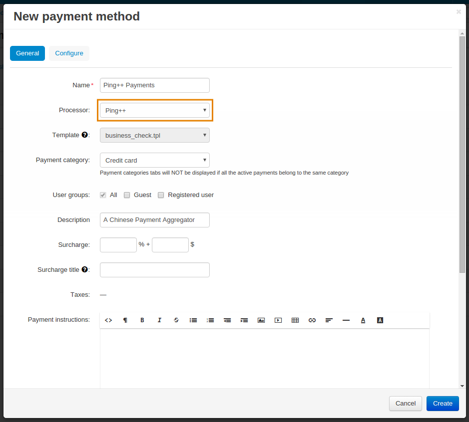

***************
Ping++ Payments
***************

**Ping++** is a Chinese payment aggregator. Payment Aggregators are service providers through which merchants can process their payment transactions. With this add-on you can accept payments via Alipay, WeChat, Baifubao, China Unionpay, and many others. After you install the add-on, you’ll be able to select the payment channels you need when :doc:`configuring the aggregator. <../../payment_methods/adding_payment>`

=====================
Installing the Add-on
=====================

.. note::

    The **Ping++ Payments** add-on is available in CS-Cart starting from version 4.7.1.

#. In the Administration panel go to **Add-ons → Manage add-ons**.

#. Switch to the **Browse all available add-ons** tab.

#. Find the **Ping++ Payments** add-on in the list.

#. Click the **Install** button right next to it.

After that you’ll be redirected to the Installed add-ons tab where the add-on will appear.

==========================
Supported Payment Channels
==========================

Ping++ Payments supports a number of popular Chinese payment channels on both mobile platforms and computers:

* Alipay Mobile;

* Alipay QR code;

* Alipay PC;
 
* WeChat;
 
* WeChat Lite;
 
* WeChat Mobile;

* WeChat QR code;
 
* Baifubao Mobile;
 
* China Unionpay Mobile;

* China Unionpay PC;

* Yeepay;

* Jdpay;
 
* Fqlpay;

* QGBC.

=========
Also Read
=========

* :doc:`../../payment_methods/ping`
