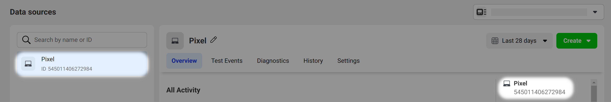
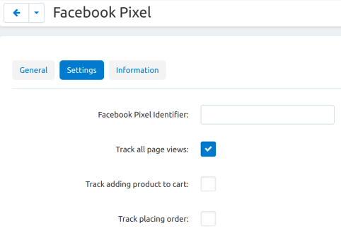
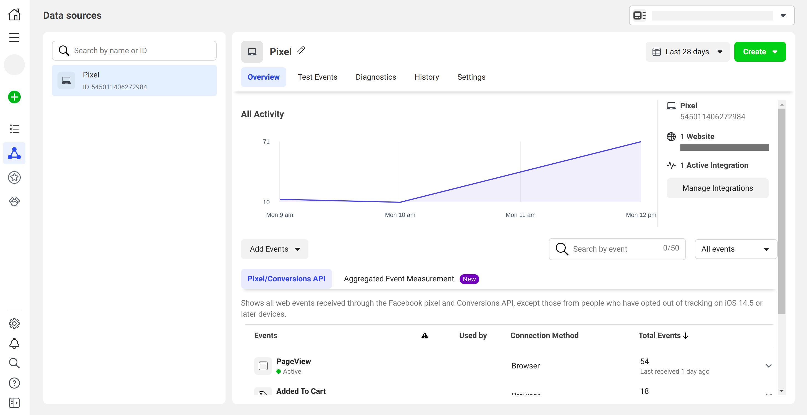
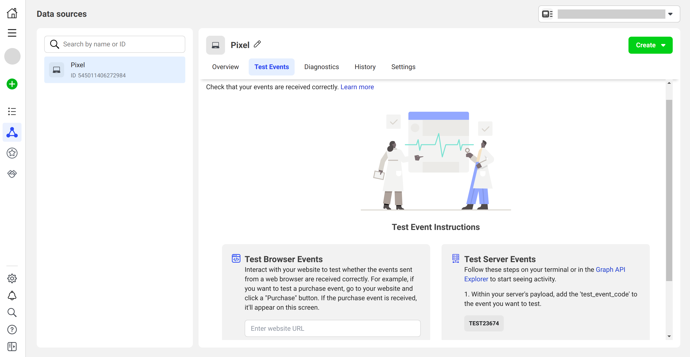

**************
Pixel Facebook
**************

.. note:: 

    You need a Facebook account to work with this add-on.

As people take action on your website (make a purchase or add an item to their cart), the `Facebook pixel <https://www.facebook.com/business/help/742478679120153?id=1205376682832142>`__ registers the event and shares it with Facebook. Event tracking helps power your Facebook ads — for example, you can launch a campaign for a more relevant audience.

The add-on helps to measure the effectiveness of Facebook and Instagram ads and collect web analytics. Users will see the received event data in `Events Manager <https://www.facebook.com/business/help/898185560232180?id=1205376682832142>`__.

.. contents::
    :backlinks: none
    :local:

=============
Functionality
=============

The Facebook pixel allows you to receive the following information about customer behavior (events):

* viewed pages;

* items added to cart;

* placed orders.

============================================
Installation and Configuration of the Add-on
============================================

Install the add-on just :doc:`like any other add-on </user_guide/addons/1manage_addons>`. Click on the name of the installed add-on to open its settings.

**Facebook Pixel Identifier**. Copy the ID of the created pixel from the pixel page, under its name.

These are the settings responsible for the support of tracked events. Tick the checkboxes and decide if you want to:

* **track all page views**;

* **track adding product to cart**;

* **track placing order**.

===================================
Creation and Configuration of Pixel 
===================================

Creation
--------

.. note:: 

    Create a `Business Manager <https://www.facebook.com/business/help/1710077379203657?id=180505742745347>`__ account before starting. Use your Facebook account information to log into Business Manager.

1. Go to `Events Manager <https://facebook.com/events_manager2>`__.

2. Click |plus_button|, to **Connect Data Sources** and select **Web**.

3. Select **Facebook Pixel** and click **Connect**.

4. Add your Pixel **Name**.

5. Enter your website URL to check for easy setup options.

6. Click **Continue**.

Configuration
-------------

If you enter the correct site URL during pixel creation and pixel ID in the add-on settings, you’ll see information about the events occurred on the *Overview* tab in Events Manager. Data can appear with a delay of up to 20 minutes.

==========================
Checking Pixel Performance
==========================

Testing Events
--------------

A Test Events tool in Events Manager can help you ensure you’ve set up the add-on and events correctly, and that Facebook receives the data.

Open the `Test Event <https://www.facebook.com/business/help/2040882565969969?id=1205376682832142>`__ tab and do not close it until testing is complete. Actions are only recorded while this tab is kept open.

In the **Test Browser Events** section, enter the URL of the site you want to test actions on. Click **Open Website** and check the pixel work according to the add-on settings: visit pages, add items to your cart, make purchases. Your interactions will appear in the *Test Events* tab within 30 seconds.

Facebook recognizes events by context. Therefore, pixel will track the events that you enabled in the add-on settings, as well as the events `predefined by Facebook <https://www.facebook.com/business/help/402791146561655?id=1205376682832142>`__. Filter the events by clicking on the filter iconto see specific types of events |filter_button|.

Plugin
------

You can also use the Chrome plugin to see if your pixel is working properly. Install `Facebook Pixel Helper <https://www.facebook.com/business/help/198406697184603?id=1205376682832142>`__ from the `Chrome Web Store <https://chrome.google.com/webstore/detail/facebook-pixel-helper/fdgfkebogiimcoedlicjlajpkdmockpc?h1=en>`__. After installation, go to your site in your Chrome browser and click the Pixel Helper icon |plugin_button| next to the address bar. An opened pop-up window will show what pixels and events were found on the page, and if they have loaded successfully.

.. |plugin_button| image:: img/plugin_button.png
