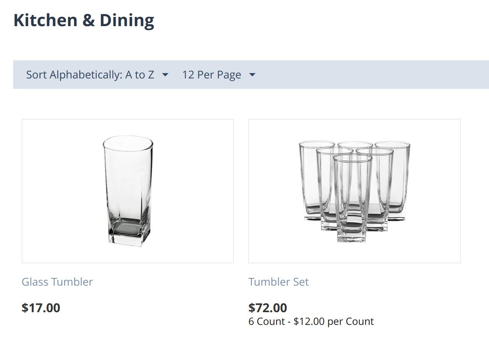

**************
Price Per Unit
**************

If you are selling products in Europe, then you must show prices per unit for some products. For example, if a store sells a product in bottles, the store owner needs to show not only the price for the bottle, but also the price per liter/milliliter. Additional price tag changes depending on the weight of the product. So, if you sell perfume in 250 ml, then you can also show the price per 100 ml.

CS-Cart and Multi-Vendor 4.15.1 introduces an add-on that allows you to specify the price per unit (liter, milliliter, kilogram, etc.)

If your store has several products in a package or box, for example a box with six glasses, then it is profitable to sell this group of products at a discount. It is easier for customers to make a purchase decision, when they see how much they can save when buying several products in one box at once. Specify the price per unit and the total price on the storefront using the “Price per unit” add-on.

=============
Functionality
=============

:doc:`After you install the add-on </user_guide/addons/1manage_addons>`, the "Price per unit" section will appear in the admin panel on the product editing page. Set the desired measurement unit there, for example "ml", "g", or "kg", and the number of units in the product. You can also specify the number of units for which will display the price if you want the price to be "per 250 ml" instead of "per ml".

For example, a jar of Coca-Cola 355 ml is on sale. The price per unit will appear automatically on the product list and on the product page. For this, you need to specify the measurement unit as “liter” and the number of units in the product as “0.355”.

:doc:`You can export and import </user_guide/import_export/about_import_and_export>` the fields in the "Price per unit" section just like any other product fields.

.. list-table::
   :widths: 35 35

   * - .. figure:: img/fields.png
              :scale: 35 %
              :align: center
              :alt: Filling in the fields on the product editing page.
     - .. figure:: img/coca-cola-cherry.png
              :scale: 30 %
              :align: center
              :alt: Product with price per unit on the storefront.
