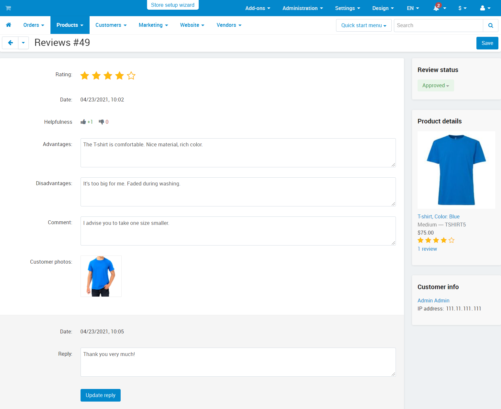

***************
Product Reviews
***************

.. note::

    The add-on is available starting with CS-Cart and Multi-Vendor 4.13.1.

This add-on enables customers to leave detailed reviews about products, as well as evaluate helpfulness of other reviews. Administrators, for their part, receive notifications about new reviews, approve or don't approve reviews, and can reply to them.

===============
Add-on Settings
===============

Find the **Product Reviews** add-on on the **Add-ons → Manage add-ons** page, and click on its name. Then switch to the **Settings** tab to see the list of add-on's settings:

* **Reviews per page**—the number of reviews to appear on one page.

* **Administrator must approve posts submitted by**—choose whether to approve posts submitted by all customers or only anonymous customers, or not to moderate reviews at all.

* **Allow one review from one IP is allowed**—if you tick this checkbox, customers will be allowed to submit only one review per product from one IP address. This can help you avoid spam.

* **Review fields**—fields that buyers will fill in when they create a review.

* **Only buyers can post**—if you tick this checkbox, customers will be able to leave a review for a product only if they bought that product.

* **Ask for customer location**—choose whether you want customers to fill in the required field about thier city or country when they create a review.

* **Split reviews by storefront**—if you tick this checkbox, all reviews will be split by storefront.

================================================
Working With Reviews in the Administration Panel 
================================================

After a customer has added a product review, a new notification will appear in the Admin panel. Click on the notification to open the review page.

Here the administrator can approve or not approve the review, view customer photos, helpfulness rate, as well as information about the buyer. You can also add a reply to the review here.

