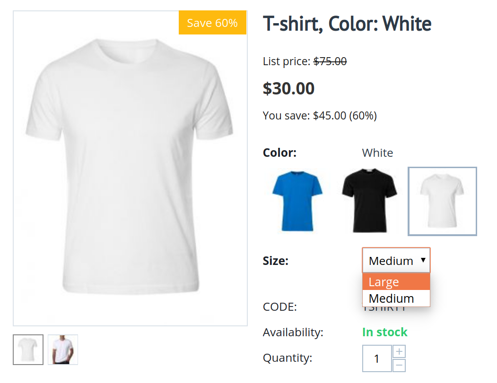

******************
Product Variations
******************

When multiple similar products are distinguished from each other by one feature, switching between these products will help customers find the one that's right for them. The **Product Variations** add-on has two purposes:

* Let customers switch between similar products on the product page.

* Help store owners manage the catalog: show the most important items in the catalog and hide all the rest.

The simplest example is a T-shirt with various colors and sizes. We want to:

* Let customers select the color and size on the product page.

* Show different colors as separate products in the catalog—that way the customer will see that the needed color is available.

* Keep different sizes to the product page, without showing them in the catalog—that way there won't be multiple different products with the same image.

================
Related Articles
================

:doc:`Working with Product Variations </user_guide/manage_products/products/product_variations>`
