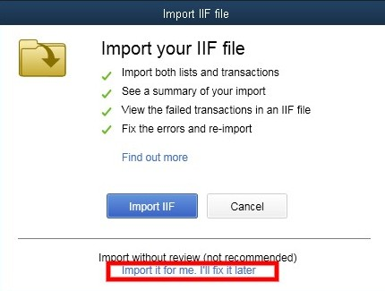

**********
Quickbooks
**********

This add-on allows you to export orders in IIF files (Intuit Interchange Format). These files can then be imported to `QuickBooks <http://quickbooks.intuit.com/>`_.  To export an IIF file:

#. Make sure that the **Quickbooks** add-on is installed and active. The add-on settings let you adjust some parameters of the exported IIF files.

   .. image:: img/quickbooks.png
       :align: center
       :alt: QuickBooks add-on settings in CS-Cart.

#. Go to **Orders → View orders**.

#. Select the orders you'd like to export.

#. Click the gear button in the upper right part of the page and choose **Export to Quickbooks**.

For instructions on how to handle IIF files and their contents, please refer to the official `QuickBooks documentation <http://quickbooks.intuit.com/quickbooks-faq/>`_ and support resources.

.. note::

    The support of QuickBooks 2019 first appeared in version 4.10.3. When you import an IIF file to QuickBooks 2019, use the **Import without review** functionality. This addresses some issues that might occur otherwise.

.. meta::
   :description: Add-on for exporting orders from CS-Cart and Multi-Vendor ecommerce platforms as IIF files to QuickBooks.
