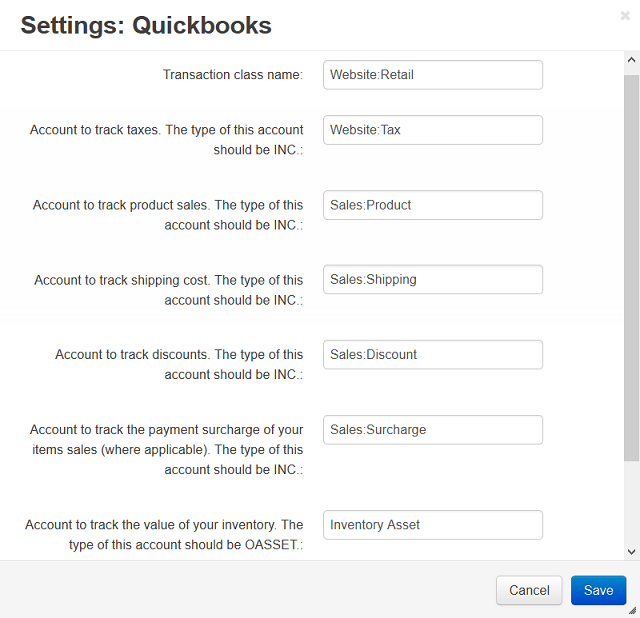

**********
Quickbooks
**********

This add-on enables you to export orders in IIF (Intuit Interchange Format) files that can then be imported into `QuickBooks <http://quickbooks.intuit.com/>`_. Here you can adjust some parameters of exported IIF files.

For instructions on how to handle IIF files and their contents, please refer to the official `QuickBooks documentation <http://quickbooks.intuit.com/quickbooks-faq/>`_ and support resources.

.. note ::

	When you enable this add-on, the **Export to Quickbooks** option appears under the gear button in the **Orders → View orders** section.
   