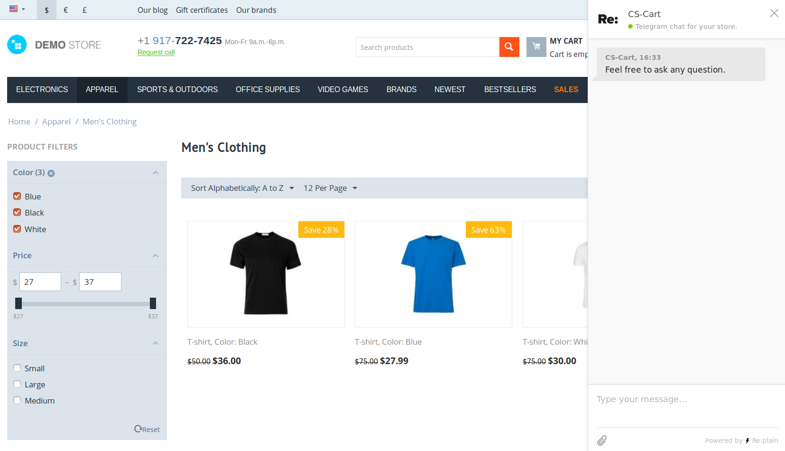

**********************
Re:plain Telegram Chat
**********************

.. note::

    This add-on first appeared in version 4.10.1.

=============
Functionality
=============

The add-on adds a Telegram chat to the CS-Cart or Multi-Vendor storefront. This is done via the `Re:plain <https://replain.cc>`_ service.

=============
Configuration
=============

#. Install **Re:plain Telegram Chat** :doc:`like any other add-on </user_guide/addons/1manage_addons>`.

#. Click on the name of the installed add-on to open its settings.

#. Make sure that the device you're using now has Telegram installed. You'll need it to use the link in the next step.

#. Create the chat with the help of `Re:plain bot <tg://resolve?domain=ReplainBot&start=g_cid_null>`_. The process is quick and easy: just follow the bot's instructions.

#. Copy the code you get from the bot into the settings of the **Re:plain Telegram Chat** add-on.

   .. hint::

       If you select a specific storefront and open the settings, you'll be able to set up a separate Telegram chat for this storefront.

#. Save your changes. Now you can use the chat `as described at the Re:plain website <https://replain.cc/faq>`_.

.. meta::
   :description: How to set up Re:plain Telegram live chat in CS-Cart and Multi-Vendor ecommerce platforms?
