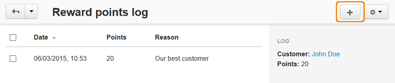
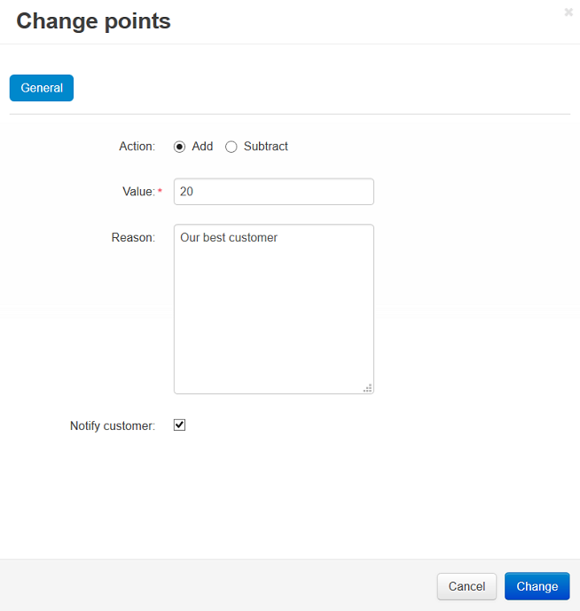

*********************************************
How To: Add Reward Points to Account Manually
*********************************************

* In the Administration panel, go to **Add-ons → Manage add-ons** and :doc:`enable the Reward points add-on <../reward_points/set_rp_addon>`.

* Go to **Customers → Customers**.

* Select a customer and click on his/her username to open the profile.

* Click the gear button on top of the page and choose **View user points**.

* Click the **+** button on the opened page to add/subtract points.

* In the opened window in the **Action** option select *Add* and in the **Value** input field enter the number of reward points you want to add.

* In the **Reason** input field enter a reason of addition.

* Tick the **Notify customer** checkbox if you want to inform the customer about the changes and click the **Change** button.

