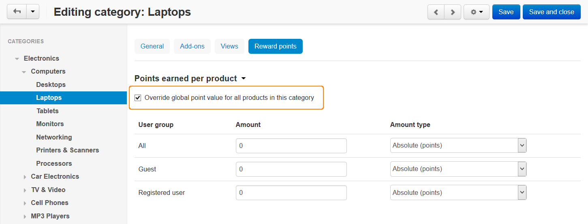

****************************************************
How To: Add Reward Points for Category Automatically
****************************************************

* In the Administration panel, go to **Add-ons → Manage add-ons** and :doc:`enable the Reward points add-on <../reward_points/set_rp_addon>`.

* Go to **Products → Categories**.

* Click on the name of the category, for which you want to add reward points.

* Open the **Reward points** tab.

* Tick the **Override global point value for all products in this category** check box.

* Choose the user group, who will receive the reward points, and in the **Amount** column enter the number of reward point to add.

* Click the **Save** button.

.. note ::

    The reward points will be added to the customer's account once his/her order has :doc:`a status that grants reward points. <../../orders/order_statuses/set_status>`
