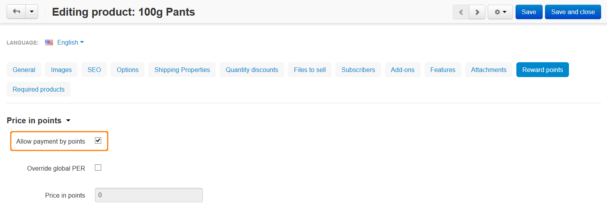

*********************************************************
How To: Set up Product Price in Points According to Ratio
*********************************************************

To configure the **Reward Points** add-on, complete the following steps:

1. Open the administration panel of your store. 

2. Go to **Add-ons → Manage add-ons**.

3. Click on the name of the **Reward points** add-on.

4. Enter the number of reward points in the **Points Exchange Rate (PER - the number of points equal to 1 conventional unit)** input field.

.. note::

    The price in points is always rounded to the next highest integer. With point exchange ratio set to 1 it would take 7 points to fully cover a $6.99 or a $6.33 order.

5. Save your changes by clicking the **Save** button.

6. Go to **Products → Products**.

7. Click on the name of the product.

8. Open the **Reward points** tab.

9. Tick the **Allow payment by points** checkbox.

10. Click the **Save and close** button.

.. note ::

    To enable the **Allow payment by points** option for all the products at once, use the **Edit selected** functionality. Please refer to `this article <http://docs.cs-cart.com/4.4.x/user_guide/manage_products/products/same_value_all_products.html>`_.

.. note ::

    Make sure that the **Override global PER** option is disabled for the products for which you want to set up price in points according to ratio.
