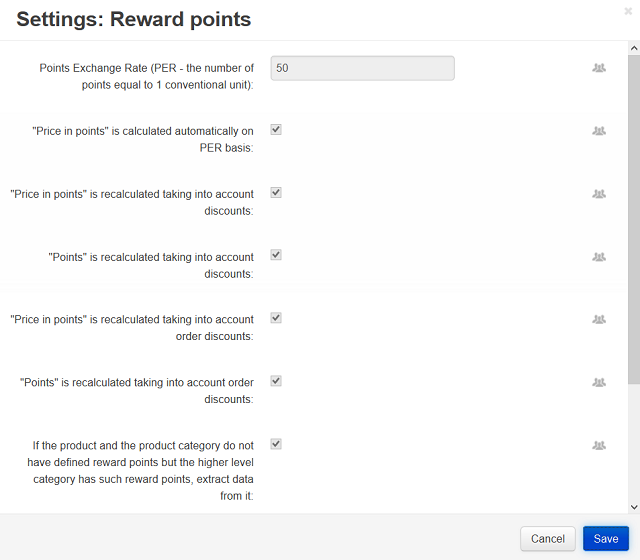

***************************************
How To: Set up the Reward Points Add-on
***************************************

* In the Administration panel, go to **Add-ons → Manage add-ons**.

* Change the status of the **Reward points** add-on to *Active*.

* Click on the name of the **Reward points** add-on.

* Configure the :doc:`settings <../reward_points/reward_points_settings>` as you wish.

* Click the **Save** button.

