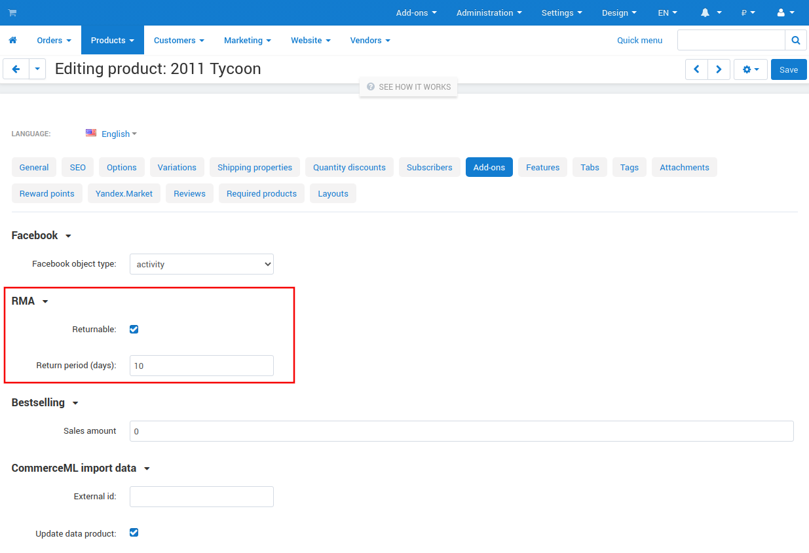
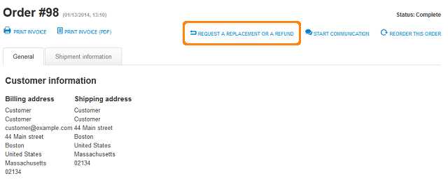

********************************
How To: Allow to Return Products
********************************

#. In the Administration panel, go to **Products → Products**.

#. Click on the name of the product, for which you want to allow return.

#. Open the **Add-ons** tab.

#. In the **RMA** section tick the **Returnable** check box.

#. In the **Return period (days)** input field enter the number of days during which a customer will be able to return a product.

#. Click **Save**.

.. note ::

	A customer will be able to send a return request on the order details page by clicking the **Request the replacement or a refund** link.

.. note ::

	A customer will be able to send a return request only if his/her order has a status for which the **Allow return registration** option is enabled on the **Order statuses** page in the administration panel. Learn more :doc:`here <../rma/set_rma>`.
