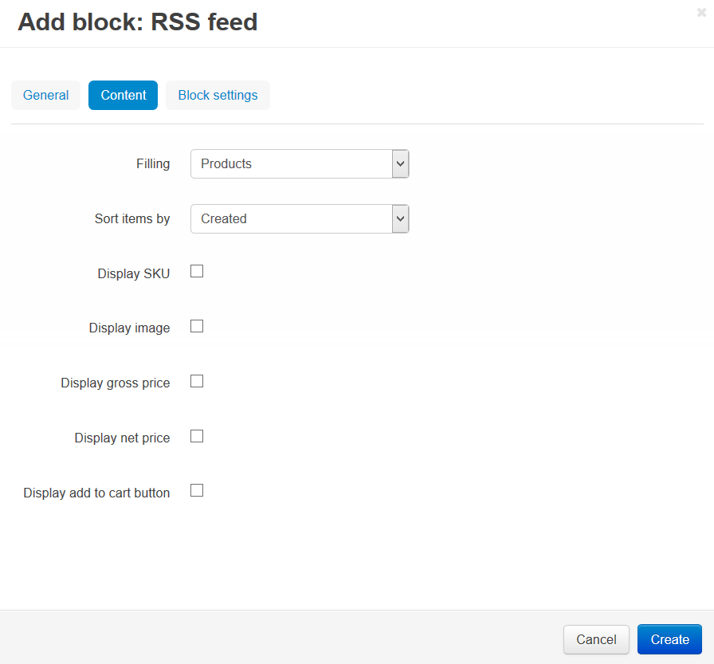

**********************************
How To: Set up the RSS Feed Add-on
**********************************

To set up the **RSS Feed** add-on:

*   In the Administration panel, go to **Add-ons → Manage add-ons**.
*   Make sure that the **RSS Feed** add-on has an *Active* status.
*   Click on the name of the add-on.
*   In the **Content editor** input field enter the editor's email and real name.

.. important ::

	It is highly recommended that you fill out an email address here. Otherwise, the RSS feed may fail to be validated.

*	Manage other settings:

	*	**Show RSS feed for each category** - If selected, the regular RSS icon is displayed next to a category name. This enables customers to subscribe to updates inside this category only.
	*	**Max product number per category** - Maximum number of products in a category-based RSS feed.

.. image:: img/rss_01.png
    :align: center
    :alt: RSS add-on settings

To enable visitors to subscribe to the RSS feed, you need to add an RSS icon to the storefront:

*   Go to **Design → Layouts**.
*   Select the layout page by clicking on the corresponding tab. Then select a container, where you want to display the icon.
*   Click the **+** button in the container and choose **Add block**. 
*   In the opened window open the **Create New Block** tab and choose **RSS Feed**. 
*   In the new window type the Name of the new block (e.g., *RSS Feed*). 

.. image:: img/rss_02.png
    :align: center
    :alt: General tab
     
*   Go to the **Content** tab. In the **Filling** select box select *Products*.
*   In the **Sort items by** select box choose one of the ways to sort the items (*Created* or *Updated*). 

*   Click the **Create** button.