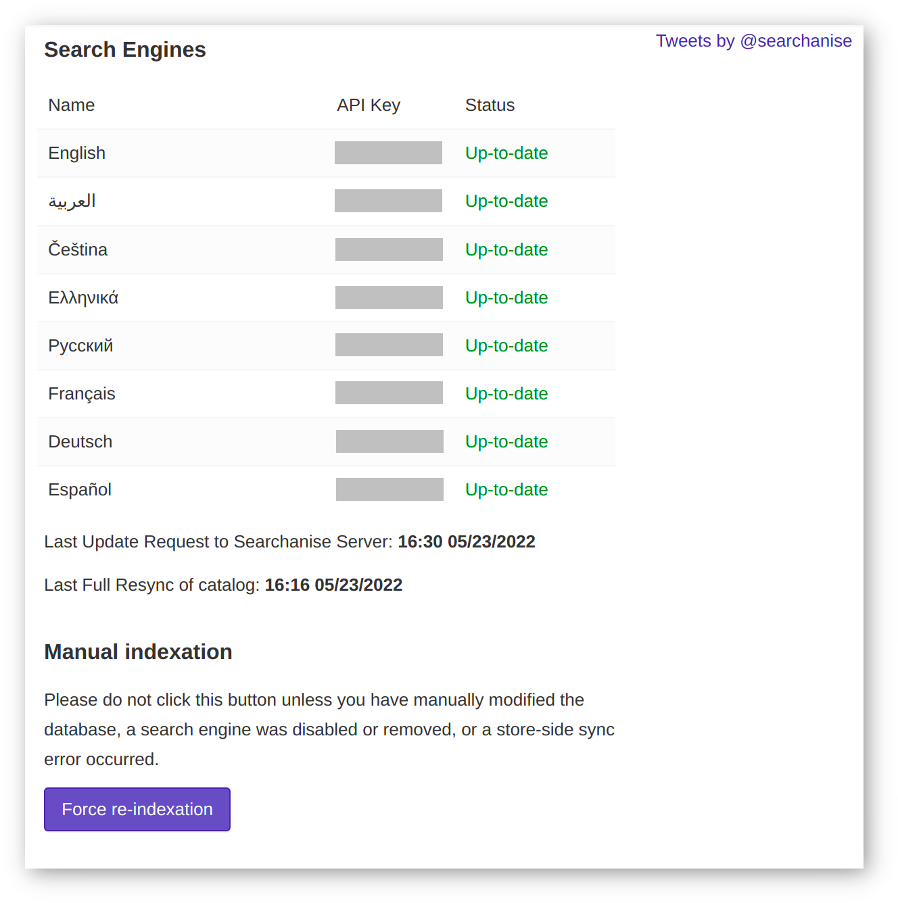

*********
Dashboard
*********

Here you can see some information about search engines: name, API key, and its status, as well as the date of last update and resync.

Manual indexation
*****************

Under the hood, search results are received from Searchanise in real-time. However, Searchanise does not retrieve data from your store database at the moment when the shoppers type in their requests as this would load the database server and significantly slow down the performance. Instead, Searchanise keeps a snapshot of the store products on its servers, and returns search results based on this snapshot. Such data includes the product description, price, features, and images/thumbnails.

The add-on tracks any changes in the products catalog and automatically syncs then with Searchanise. Usually, it takes two or three minutes to complete. However, you can force to synchronize data by clicking the **Force re-indexation** button.

This is rather a time-consuming operation that is unnecessary in most cases. You'll need to start the re-indexation manually to update the search results after:

* you've made changes directly to the database;
* you've activated/deactivated a language;
* a store-side sync error occurred.

:doc:`Back to general info </user_guide/addons/searchanise/index>`