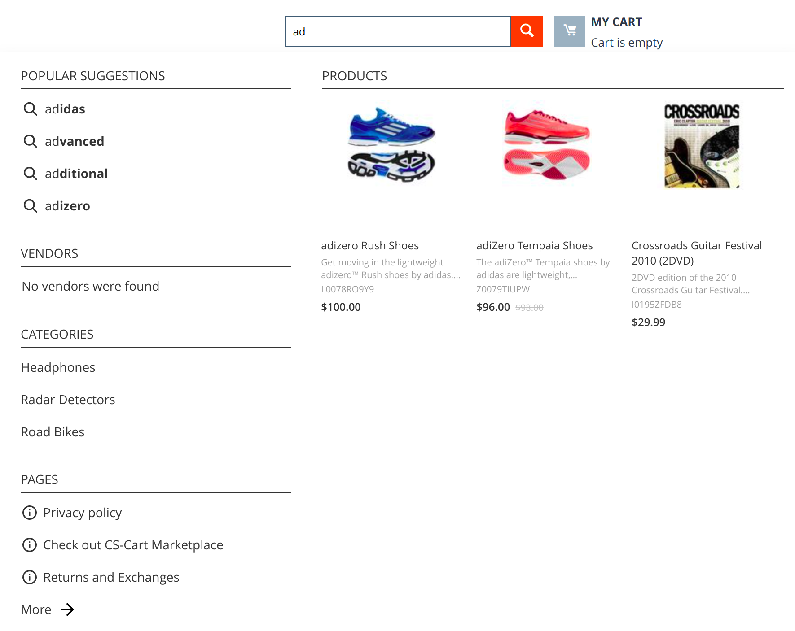
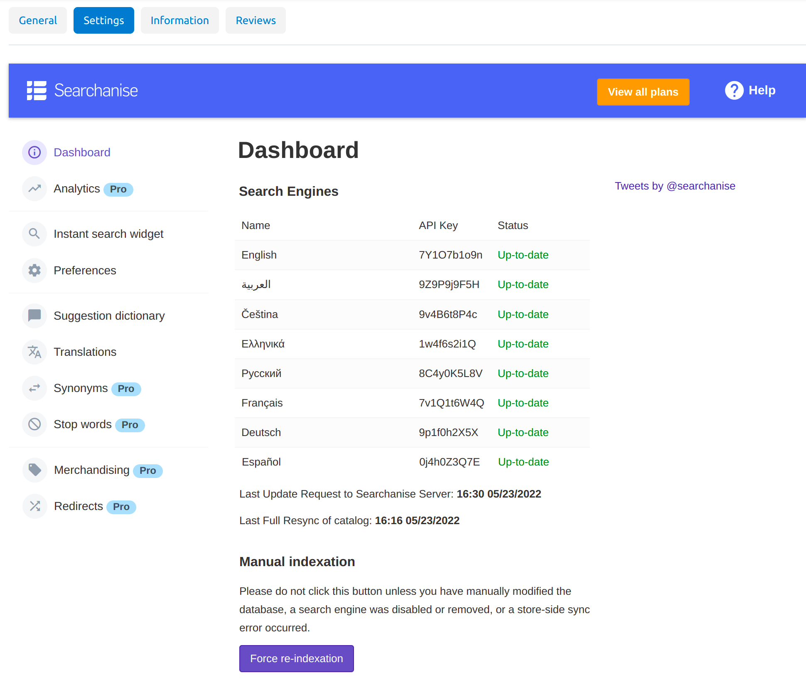
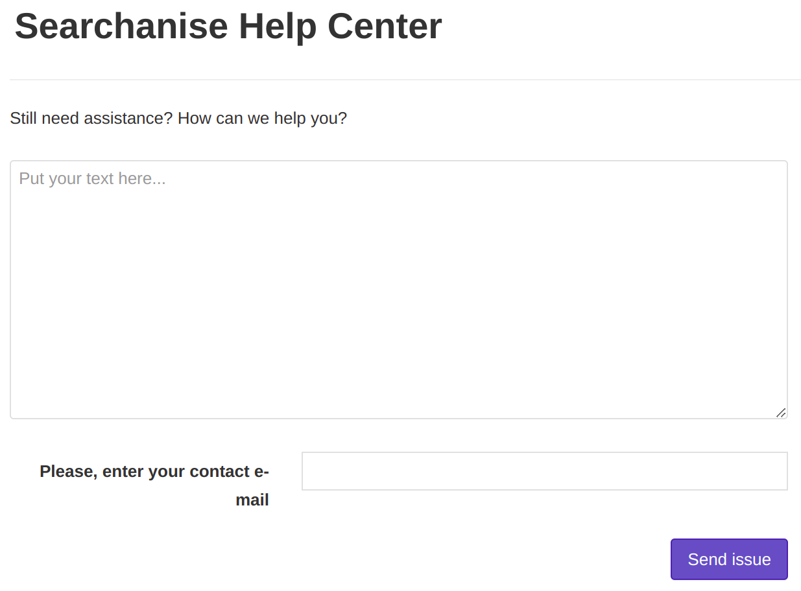

***********
Searchanise
***********

The **Searchanise** add-on integrates CS-Cart with the SaaS-solution of the same name. It adds enhanced instant product search to the storefront by replacing its regular search bar with a special search widget. Shoppers see search results as they type in the search bar, and can quickly review the found products. So, customers can get to the right product way much faster because they don’t even have to finish typing while the preview box forms the first impression of the product.

To set up the **Searchanise** add-on:

#. In the administration panel go to **Add-ons → Manage add-ons**.

#. Switch to the **Browse all available add-ons** tab.

#. Find the **Searchanise** add-on and click the **Install** button next to it.

#. Once the add-on is installed, find it on the list of add-ons and click on its name.

#. Click the **Connect Store to Searchanise** button.

Searchanise can search through products, categories and pages (i.e., blog posts) in your store.

.. note::

   Searchanise can find products by product code, name, description, and features. Starting with version 4.3.7, it can also search products by option combination code. 

.. important ::

	Searchanise is incompatible with the `Age Verification <http://docs.cs-cart.com/4.3.x/user_guide/addons/age_verification/index.html>`_ add-on because this add-on controls access to products on the category level while Searchanise processes store data on the product level and takes no account of categories and their properties.

 

With the Searchanise panel you can navigate through the Searchanise sections that are described separately further in this guide.

Above this panel you can see the **Unlock Pro features** button with that you can learn more about `Searchanise Pro features <http://start.searchanise.com/pricing/>`_ and update to it.

In this panel you can also see the **Help** icon. Click it to send a message to Searchanise developers. Feel free to ask us any questions and suggest your solutions for improvement of our search widget.

To send a message, type your text in the text area, write your e-mail in the **Contact e-mail** field, and click **Send message**.

.. toctree::
    :maxdepth: 2
    :titlesonly:
    :glob:

    dashboard
    search_preview
    instant_search_widget
    suggestions
    redirects
    synonyms
    promotions
    stop_words
    analytics
    product_feeds
