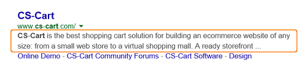
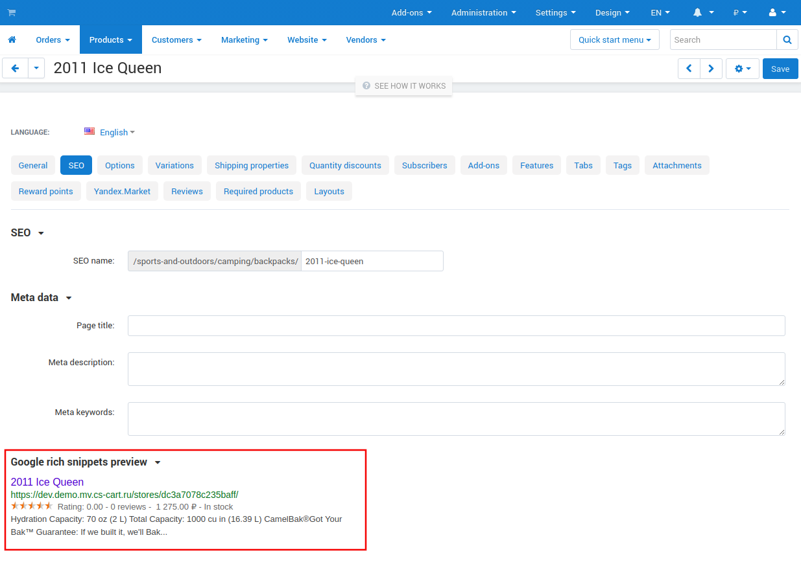

***
SEO
***

.. contents::
    :backlinks: none
    :local:

    
Functionality
=============

**SEO** is a common acronym for *Search Engine Optimization*. Obviously, the add-on aims at helping you optimize your web store for search engines and improve its ranking.

Optimization consists in replacing unattractive dynamic URLs like *http://www.example.com/index.php?dispatch=products.view&product_id=1533* containing query strings and ancillary data with clean search engine friendly URLs like: *http://www.example.com/true_product_name.html*.

Such URLs not only help search engines to index store pages, but they also improve your customers' experience, as clean URLs are human-readable and thus are easy to perceive and remember.

.. note ::

	The add-on requires that your web server have a URL rewriter installed. For the Apache HTTP Server or any Apache interchangeable implementation it must be the *mod_rewrite* module. For Microsoft Internet Information Server (IIS) it must be *ISAPI_Rewrite*.

Rich Snippets
-------------

When you search for something with Google search engine, you can see few lines of text under every search result. These are **snippets**. They help users to understand what is a page about and why it is relevant to their query.

**Rich snippet** is a markup easily understood by search engines that base on this markup when displaying additional data in search results.

In CS-Cart rich snippets for product pages are generated automatically. The snippet contents are formed based on some product information such as description and price. To check the rich snippet for particular product, do the following:

#. In the Administration panel, go to **Products → Products**.

#. Choose a product and open its editing page by clicking on the product name.

#. On the opened page choose the **SEO** tab.

#. You can see the rich snippet at the bottom of the page in the **Google rich snippets preview** section.

    

Management of SEO Names
-----------------------

You can change the format of SEO names in your store if needed. It can be done in the **SEO** add-on settings. Find out more about :doc:`how to confugure the add-on </user_guide/addons/seo/seo_settings>`. 

The number is added to a SEO name if the same name is already in use for another object (product, category, etc). This was created so that if the administrator gives the same name for two categories (products, manufacturers, etc), CS-Cart adds *1* to SEO name of the second category automatically. 

.. important::

	For example, if the administrator gives the SEO name *Books* to a category аnd then gives the same name to another one, CS-Cart adds *1* to the second one. And after that, the first category will have the *Books* name and the second one will have the *Books1* name. 
	
	If the administrator gives the SEO name *Books* to one more category CS-Cart adds *1-2* to the SEO name of this category and so on.
	
	
Canonical URLs
--------------

To make you site better understood by search engines, **canonical URLs** for categories and products are generated in CS-Cart.

If some URL is marked as the canonical, search engine robot understands that this is the original content URL and there is no need to index its duplicates. The example is the same page with products or categories list, but with different sortings. There is no need to index all these page variants, and using canonical URLs is very useful here.

Related Articles
================

.. toctree::
    :maxdepth: 2
    :titlesonly:
    :glob:

    seo_rules
    301_redirects
    seo_not_work
    seo_addon_technical_info
    seo_settings
    
.. toctree::
    :maxdepth: 2
    :titlesonly:    
    :hidden:
    
    seo_functionality
    canonical
    rich_snippets
    seo_names
    numbers

.. meta::
    :description: CS-Cart and Multi-Vendor SEO add-on to help ecommerce store owners to deal with search engine optimization
    
