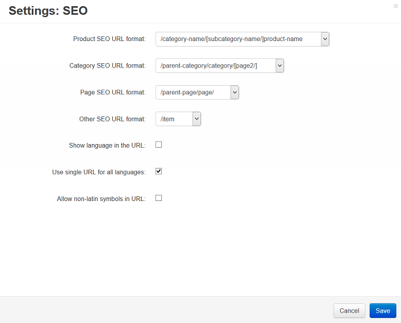

*******************
Format of SEO Names
*******************

.. warning::

    This article may no longer be relevant or up to date. Please :doc:`return to the main page of the section </user_guide/addons/seo/index>`.

To change the format of SEO names:

*   In the Administration panel, go to **Add-ons → Manage add-ons**.
*   Click on the name of the **SEO** add-on.
*   In the opened window you can edit the following settings:

    *   **Product SEO URL format** — specifies the product page name.
    *   **Category SEO URL format** — specifies the categories page name.
    *   **Page SEO URL format** — specifies names for other store pages.
    *   **Other SEO URL format** — specifies names for other items.
    *   **Use single URL for all languages** — if enabled, URL of the base language will be used for all the other languages (for backward compatibility with old systems).
    *   **Show additional language in the URL** — defines whether to display the language name in the SEO names.

	.. note ::

		**For example:** If the **Show additional language in the URL** option is enabled and the English language is used, the SEO name will be

		`http://demo.cs-cart.com/en/adidas-mens-climacool-mesh-polos.html <http://demo.cs-cart.com/en/adidas-mens-climacool-mesh-polos.html>`_.
		
		If the Show language in the URL option is disabled, the SEO name will be

		`http://demo.cs-cart.com/adidas-mens-climacool-mesh-polos.html <http://demo.cs-cart.com/adidas-mens-climacool-mesh-polos.html>`_.

    *   **Allow non-latin symbols in URL** — if selected, URLs can contain symbols from different languages.

