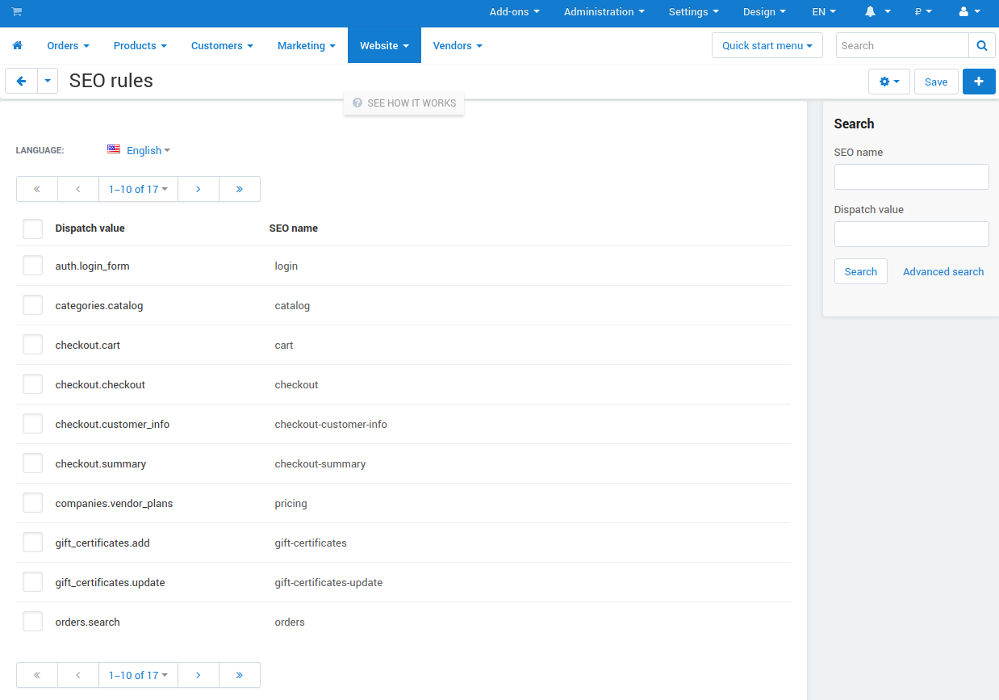

*********
SEO Rules
*********

.. important::

    To control the URL names in your store, enable and configure the :doc:`/user_guide/addons/seo/index` add-on under **Add-ons → Manage add-ons**.

The **Website → SEO → SEO rules** section allows you to define rules for URL rewriting in your store. You can replace URLs like *http://www.example.com/index.php?dispatch=auth.login_form* with user-friendly URLs optimized for search engines, like *http://www.example.com/login*. Moreover, with the provided multi-language support, your shopping cart will be indexed by search engine crawlers in different languages.

Here you need to specify the URLs that should be rewritten and their substitution names. 

* **Dispatch value**—the value of the ``dispatch`` parameter from the standard URL (for example, ``auth.login_form`` for the URL *http://www.example.com/index.php?dispatch=auth.login_form*)

* **SEO name**—the value to which the standard URL will be changed (for example, ``login`` for *auth.login_form*). You can specify this value with *.html* extension if required.

You can use the following list as an example:

.. meta::
    :description: How to configure SEO rules in SEO add-on for CS-Cart and Multi-Vendor ecommerce platforms?
