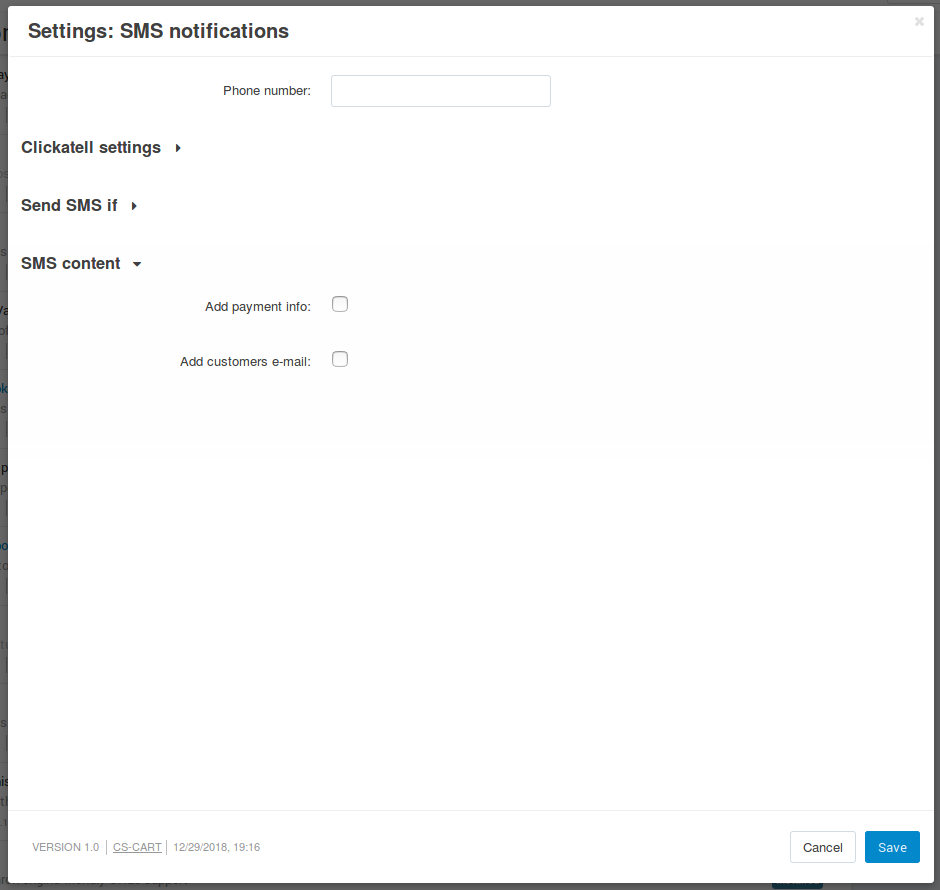

*********************************
If SMS Notifications Are Not Sent
*********************************

If SMS notifications are not sent, check your error logs:

*   In the Administration panel, go to **Administration → Logs**.
*   Click the **Advanced search** link and in the **Type/Action** option select *Requests*.
*   Click the **Search** button.

.. note ::

	The requests concerned with the SMS notifications should contain the *http://api.clickatell.com/http/sendmsg* link in the **URL** section.

If you see the following error in the found requests:

.. code-block :: none

	Response: ERR: 113, Max message parts exceeded

it means that the SMS notification text was too long to be sent.

In order to solve this problem:

*	Go to **Add-ons → Manage add-ons**.
*   Click on the name of the **SMS notifications** add-on.
*   In the opened window in the **SMS content** section untick the **Add payment info** and **Add customers e-mail** check boxes.
*   Click the **Save** button.

