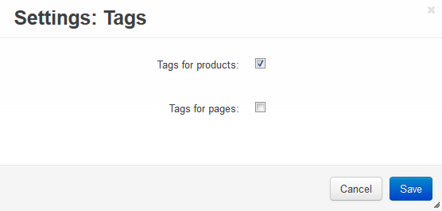
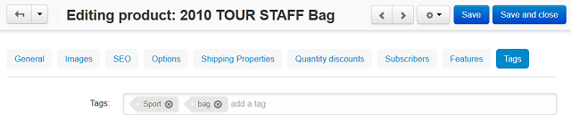

***********************
How To: Add a Tag Cloud
***********************

*   In the Administration panel, go to **Add-ons → Manage add-ons**.
*   Enable the **Tags** add-on (change its status to *Active*).
*   Click on the name of the add-on.
*   Select the desired options:

    *   **Tags for products** – If selected, the functionality to add tags to product pages appears in the store.
    *   **Tags for pages** – If selected, the functionality to add tags to static content appears in the store.

*	Click the **Save** button.

Set up tags for products:

*   Go to **Products → Products** and click on the name of the product for which you want to create tags. 
*   Open the **Tags** tab on the page, in the **Tags** input field enter tag names one by one. Click the **Tab** button on your keyboard to create new tags.
*   Click the **Save and close** button.

Add the **Tag cloud** section to the storefront:

*   Go to **Design → Layouts**.
*   Choose the layout page where you want to display the tag cloud. For example, click *Homepage*.
*   Click the **+** button in a container where you want to display the tag cloud and choose **Add block**. Open the **Create New Block** tab, and choose **Tags**. 
*   In the opened window specify the block Name (e.g. *Tag Cloud*). In the **Template** select box select *Tag cloud* and click the **Create** button.
*   Click on the gear icon of the created block:

    *   In the **Wrapper** select box select a wrapper.
    *   in the **User-defined CSS-class** input field specify the CSS-class, if needed.
    *   Click the **Save** button.

.. image:: img/tags_03.png
    :align: center
    :alt: Tag cloud section

All the tags defined by the store administrator will be displayed in the **Tag cloud** block.

.. note ::

	After the block is created or changed, make sure it is displayed correctly. Sometimes not all wrappers are suitable for the blocks.