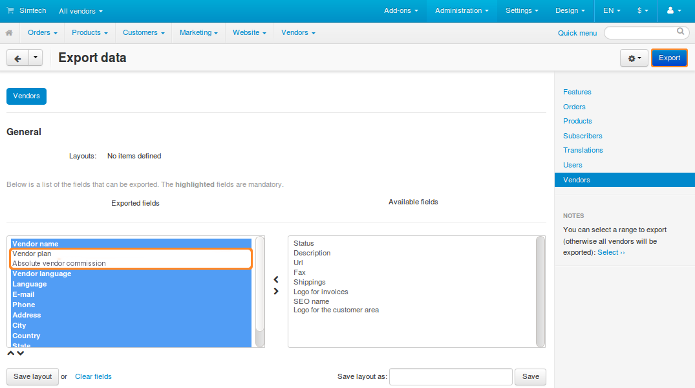

******************************************************************
Upgrading from 4.3.x to 4.4.x: Vendor Commissions and Vendor Plans
******************************************************************

.. note::

    This article applies only to **Multi-Vendor**.

=========================
What Has Changed in 4.4.x
=========================

Multi-Vendor 4.3.x had an add-on called **Vendor Commission**. It allowed store owners to set a separate commission (a fixed sum or a percentage) for each vendor. That commission appeared as a separate column in the Administration panel under **Vendors → Account balance** and affected the total unpaid balance.

This add-on has been replaced by the **Vendor Plans** add-on in Multi-Vendor 4.4.1. Store owners can now set up subscription plans for vendors. Plans can include restrictions, such as maximum number of products, maximum revenue, and more. Vendors may be asked for a one-off payment or a regular subscription fee for a plan.

Each vendor plan has a separate **Transaction fee**, which is the equivalent of a commission. However, a transaction fee can only be set as a percentage, and not as a fixed sum.

.. note::

    Learn more about **Vendor Plans** `here <http://forum.cs-cart.com/topic/43981-meet-vendor-plans-for-multi-vendor-436/>`_.

==============================================
How Commissions Turn Into Plans During Upgrade
==============================================

When you upgrade to 4.4.x from 4.3.x, a separate hidden plan is created for each vendor. The plan has no limitations or subscription fees. But the **Vendor Plans** add-on doesn’t support fixed sum commissions, so absolute and relative commissions are handled differently:

* A relative commission (percentage) is moved to the newly-created vendor plan as a transaction fee.

* An absolute commission (fixed sum) is still stored in the database, but isn’t used in the vendor plan. The transaction fee is set to 0.

==========================================================
Setting up Plans for Vendors That Had Absolute Commissions
==========================================================

After the upgrade you can find out which vendors used absolute commissions before. This will help you to create new plans for them, if necessary.

-------------------------------------------------------
Step 1. Get a List of Vendors with Absolute Commissions
-------------------------------------------------------

1.1. Go to **Administration → Export data → Vendors** in the Administration panel of your store.

1.2. Add **Absolute vendor commission** and **Vendor plan** to the list of exported fields.
 
1.3. Click **Export**.

1.4. Open the CSV file in the table processor of your choice (for example, OpenOffice Calc or Microsoft Excel).

1.5. Sort the data by the **Absolute vendor commission** column—that way you’ll see the vendors that had absolute commissions before the upgrade.

------------------------------------------
Step 2. Create New Plans for Those Vendors
------------------------------------------

.. note::

    Multiple vendors can use the same plan, so it’s up to you how many plans you need.

2.1. Go to **Vendors → Vendor plans** in the Administration panel of your store.

2.2. Click the **+** button (*Add vendor plan*).

.. image:: img/add_vendor_plan.png
    :align: center
    :alt: Adding vendor plans in Multi-Vendor.

2.3. A pop-up window will open. It has multiple tabs where you can configure the plan.

     * **General**: enter the name, description, and status of the plan.

       .. hint::

           Setting **Status** to *Hidden* is a good way to make a plan exclusive to some vendor. Other vendors won’t be able to see or select this plan.

     * **Commission**: set the plan price and transaction fee, if necessary.

     * **Restrictions**: limit the number of products and maximum revenue for the vendors that use this plan. Choose whether this plan allows vendors to have their microstore—a separate section of the store that has the products belonging only to the specific vendor.

     * **Categories**: choose the product categories available for the vendors that use this plan.

2.5. Once you have configured the plan, click **Create**.

2.6. Repeat the steps from 2.1 to 2.5 and create separate plans for all vendors that need their own unique conditions.

--------------------------------------------
Step 3. Assign New Plans to Multiple Vendors
--------------------------------------------

3.1. Open the CSV file that lists vendors and the plans assigned to them. We got that file at step 1.4.

3.2. Enter the ID of the desired plan for each vendor in the **Vendor plan** column. You can get the plan ID in the Multi-Vendor Administration panel:

     * Go to **Vendors → Vendor plans**.

     * Click the gear button next to the name of the desired plan.

     * Hover the cursor over **Edit**, but don’t click it. You should see the URL in the bottom left corner of the browser window.

     * Use the value of ``plan_id`` from the URL. For example, it's *9* in the picture below.

.. image:: img/vendor_plan_id.png
    :align: center
    :alt: Find vendor plan ID in Multi-Vendor.

3.3. Save the CSV file.

3.4. Go to **Administration → Import data → Vendors**.

3.5. Go down to **Select file** and click the **Local** button.

3.6. Choose the CSV file that you were editing.

3.7. Click **Import**. The plans will be assigned to vendors according to the CSV file.

.. note::

    Even if a plan isn’t assigned to any vendor, it will not be deleted. You might want to delete some unused plans after the import.
