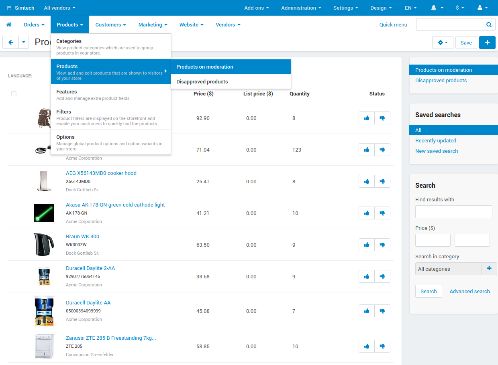

*************************
Vendor Data Premoderation
*************************

.. important::

    This add-on is available only in **Multi-Vendor**.

This add-on ensures that vendors don't add unwanted information or make unnoticed changes to their products and profiles. The add-on can hide new or modified products from customers until these products are reviewed by an administrator. Administrators can approve the products to make them visible on the storefront, or disapprove them. In that case, vendors will be able to make changes, and the product will be sent for approval again.

Marketplace administrators and vendors can easily check, which products require approval or were rejected. They are also notified when products require approval, get approved or rejected.

============
Installation
============

.. note::

    The **Vendor Data Premoderation** add-on is installed by default.

#. Go to **Add-ons → Manage add-ons**.

#. Find the **Vendor Data Premoderation** add-on and make sure it has the **Active** status.

===============
Add-on Settings
===============

The settings of the add-on let you choose what data and what vendors are affected by premoderation.

* **Approval of newly-created products**—if approval is required, then customers won't see vendor's new products until a marketplace administrator approves them.

* **Approval of product info updates**—if approval is required, then any change to vendor's existing products must be approved by a marketplace administrator. Until then, unapproved products won't be visible to customers.

* **Approval of newly-created vendors**—if approval is required, then all the new vendor accounts must be approved by a marketplace administrator. Until then, the default :doc:`vendor status <user_guide/users/vendors/vendor_statuses>` will be *Pending*.

* **Approval of vendor profile updates**—if approval is required, then any change to vendor's profile will need to be approved by a marketplace administrator. Until then, vendor will get the *Pending* status and won't appear to customers on the storefront.

Here are the possible values of these settings:

* *Required for all vendors*—the changes made by any vendor will have to be checked before becoming visible.

* *Required for some vendors*—the **Add-ons** tab of the :doc:`vendor editing page </user_guide/users/vendors/index>` will get a setting that determines whether or not this particular type of data by this particular vendor requires premoderation.

* *Isn's required*—the changes made by any vendor will be visible instantly.

  .. image:: img/vdp_settings.png
      :align: center
      :alt: Add-on settings

================
Related Articles
================

* :doc:`/user_guide/users/vendors/product_approval`

.. meta::
   :description: How to hide vendor's products in Multi-Vendor ecommerce CMS until administrator checks and approves them?
