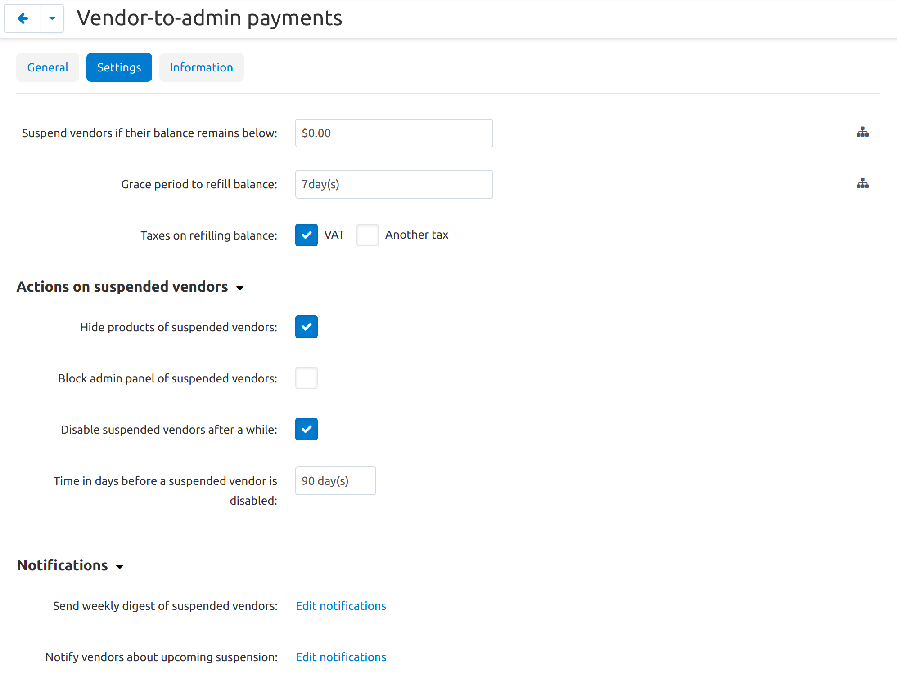

*****************************************************
How To: Configure Vendor-to-Admin Payments Add-on
*****************************************************

.. important::

    This add-on replaced the Vendor Debt Payout add-on in Multi-Vendor 4.12.1.

Install the Vendor-to-Admin Payments add-on just like :doc:`any other add-on </user_guide/addons/1manage_addons>`. After the installation, click on the add-on name to open its settings. Here you can do the following:

* Decide what restrictions to apply to suspended vendors: hide their products and/or block their admin panels.

* Decide whether to completely disable accounts of those vendors who don't pay their debts for a long time (and when to disable them).

* See what notifications the add-on has, and edit them.

