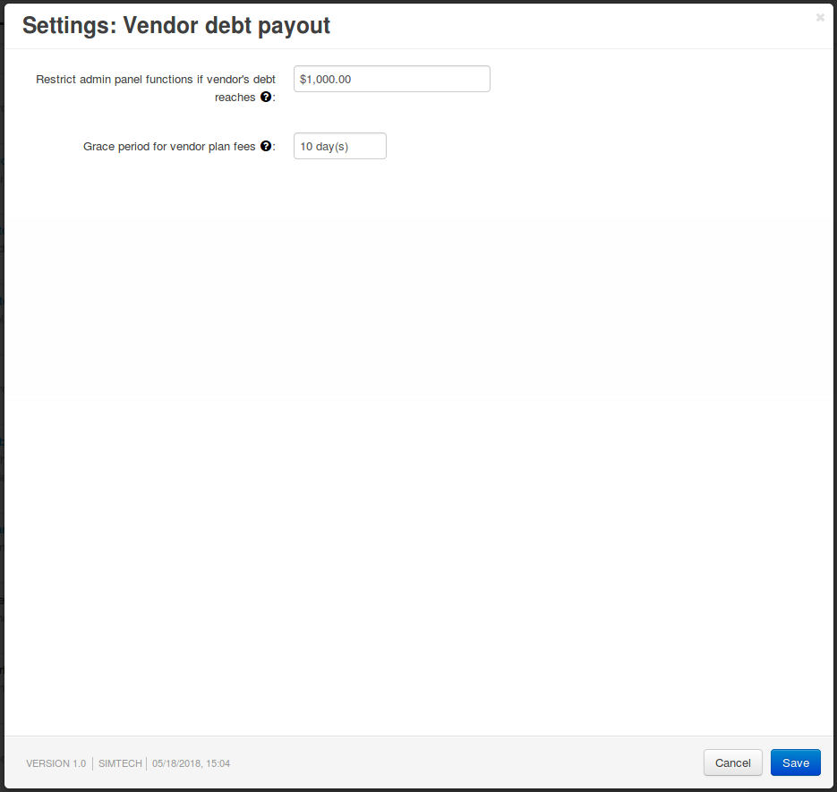

**********************************
Vendor Debt Payout Add-on Settings
**********************************

.. note::

    This add-on is available only in Multi-Vendor 4.8.1 and newer versions.

The **Vendor debt payout** add-on is a tool for controlling vendors. It allows you to block vendors' access to their administration panels automatically under certain conditions. The conditions are specified in the add-on's settings.

To reach add-on settings, go to **Add-ons → Manage add-ons**, and find the **Vendor debt payout** add-on and click on its name. If you can't find the add-on there, it might not be installed. To install it, switch to the **Browse all available add-ons** tab; you should find the add-on there.

The add-on has the following settings:

* **Restrict admin panel's functions if venor's debt reaches**—the maximum debt that a vendor can have. It doesn't matter whether you enter a positive or a negative number here—a vendor's balance has to be negative and reach this number.

  When a vendor's negative balance is half this number, the vendor will see a warning message. If necessary, you can edit the message in the ``vendor_debt_payout.debt_near_limit_message`` :doc:`language variable </user_guide/look_and_feel/languages/translate>`.

  Once a vendor's balance is negative and reaches this number, the vendor's administration panel will not allow to perform any actions. The only option available for vendor would be to go and pay the debt (referred to as *marketplace fees*).

  The process of paying the debt is similar to buying a product from the marketplace. Once the order reaches the *Processed* or *Complete* status, the vendor's administration panel will be unblocked automatically.

* **Grace period for vendor plan fees**—the period during which a vendor must pay for using the chosen :doc:`vendor plan </user_guide/addons/vendor_plans/index>`; otherwise the vendor's administration panel will not allow any actions, except for paying for the plan.

  By default, money is taken from vendor's account balance while it's positive. But if the balance becomes negative after payment, the grace period starts. When entering the administration panel, vendor will see a warning that there is a debt that needs to be paid.

  If the vendor ignores the reminders, and the grace period expires, then the functionality of the vendor's administration panel will be limited as described above.

  .. important::

     Even if the vendor's balance becomes positive during the grace period, the sum of the debt that the vendor has to pay won't change. This is the intended behavior.

