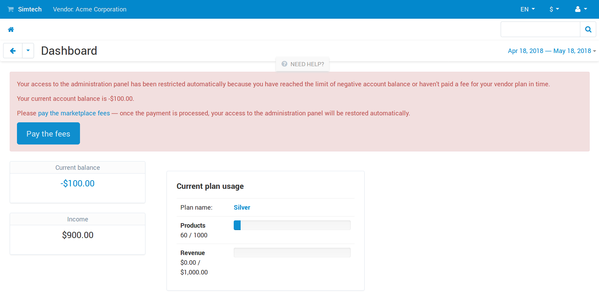

******************
Vendor Debt Payout
******************

.. note::

    This add-on is available only in Multi-Vendor 4.8.1 and newer versions.

By default, all the money from orders in Multi-Vendor goes to the marketplace owner and is then distributed among vendors. This distribution can be manual or automatic (with add-ons like :doc:`Stripe Connect </user_guide/addons/stripe_connect/index>` or :doc:`PayPal for Marketplaces </user_guide/addons/paypal_for_marketplaces/index>`).

But what if you use :doc:`Vendor Plans </user_guide/addons/vendor_plans/index>` and a vendor gets no orders, while the fees for plans keep accumulating? Or what if you offer some service to the vendor and collect a fee for it with :ref:`manually created payouts <payout>`? That could lead to a situation when the vendor's balance is negative. 

Previously you had to track down those vendors and deal with them manually. But now the **Vendor Debt Payout** add-on gives marketplace owners some automated tools to deal with debtors.

.. contents::
   :backlinks: none
   :local:

==============================
Tools for Dealing with Debtors
==============================

-----------------------------------------
Warnings about Debts and Vendor Plan Fees
-----------------------------------------

Depending on how you :doc:`configure the add-on </user_guide/addons/vendor_debt_payout/configure>`, vendors will receive notifications in two cases:

* When their debt reaches a certain limit.

* When the vendor's balance gets negative after a fee for the vendor plan has been taken.

  .. image:: img/fee_notification.png
      :align: center
      :alt: A warning about vendor's debts in the admin panel.

These notifications contain a link to the page where vendors can pay their debts and plan fees (together they are referred to as *marketplace fees*). A vendor with negative balance can also see a button for paying the fees on the dashboard.

-------------------------------
Ability to Pay Marketplace Fees
-------------------------------

When vendors decide to pay their debts, they're redirected to checkout on the storefront, with a product called *Marketplace fees* already in their carts. It works just like buying a product from your marketplace. Although this approach requires action from vendors, it allows you to use any payment methods, even if they weren't designed with marketplaces in mind.

Once the order placed by the vendor is marked as *Processed* or *Complete*, the account balance changes. If the vendor's administration panel had been blocked earlier, it will be unblocked.

.. image:: img/vendor_fee_payment.png
    :align: center
    :alt: A vendor pays marketplace fees on the storefront.

---------------------------------
Blocking of Debtors Who Don't Pay
---------------------------------

If a vendor ignores the debt warnings or a reminder to pay for using the plan, the access to the vendor's administration panel will be limited. The vendor won't be able to do anything in the admin panel, except for paying the marketplace fees. Once that is done, and the order placed by the vendor is *Complete* or *Processed*, the full access to the admin panel will be restored.

================
Related Articles
================

.. toctree::
    :maxdepth: 2
    :titlesonly:
    :glob:
    
    *

* :doc:`/user_guide/users/vendors/workflow`
