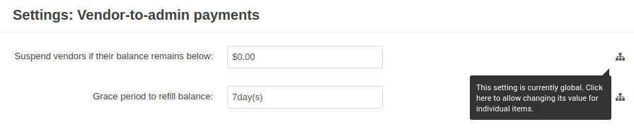
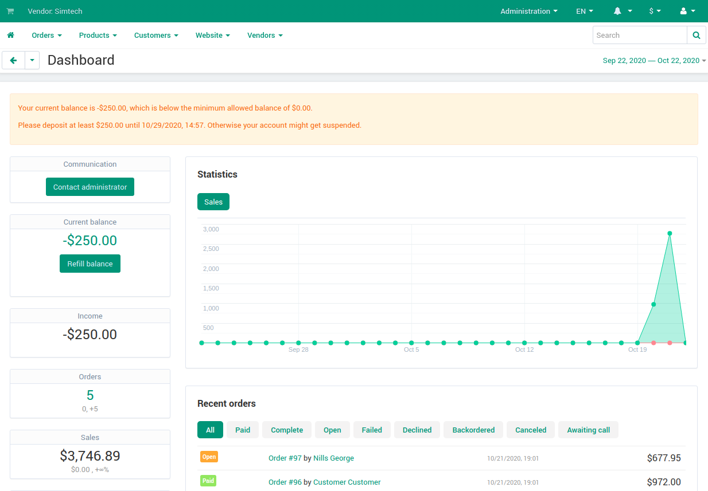
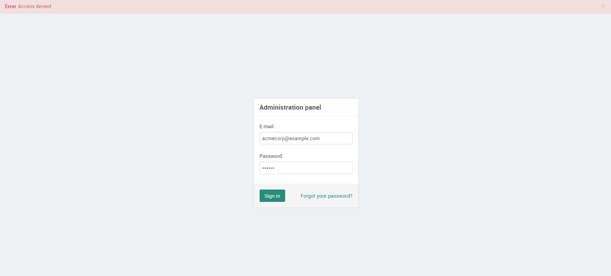

************************
Vendor-to-Admin Payments
************************

.. important::

    This add-on replaced the Vendor Debt Payout add-on in Multi-Vendor 4.12.1.
   
By default, all the money from orders in Multi-Vendor goes to the marketplace owner and then splits between vendors. For more information, please check :doc:`the article about money flow in Multi-Vendor and how to control it </user_guide/users/vendors/workflow>`. 

The marketplace owner earns money on commissions and vendor plan fees. But what if a vendor doesn't get orders? Or the marketplace owner charges him for some service, and the vendor can’t pay in time? This is how the vendor may become a debtor. 

Previously, marketplace owners had to deal with debtors manually or use the Vendor Debt Payout add-on. In new versions of Multi-Vendor, the Vendor-to-Admin Payments add-on was created to completely replace the old add-on.

.. contents::
    :backlinks: none
    :local:

Functionality
=============

The **Vendor-to-Admin Payments** add-on allows you to work with debtors automatically. The marketplace owner can hide the debtor's products and/or  block the debtor's admin panel. If the debt is not paid for a long time, the suspended vendor may be disabled.

Decide When Vendors Become Debtors
++++++++++++++++++++++++++++++++++

The add-on allows you to set the minimum allowed balance for vendors, and the time to refill the balance after it goes below that point. If a vendor doesn't refill the balance within that time, he or she will be considered a debtor and get the *Suspended* status with all the associated restrictions.

By default, the settings are global and are located on the add-on level. But you can allow different values for individual :doc:`vendor plans </user_guide/addons/vendor_plans/index>`.

.. image:: img/plan_settings.png
    :align: center
    :alt: Configure minimum allowed balance and grace period in vendor plans settings

Decide What to Do with Debtors
++++++++++++++++++++++++++++++

Even without the add-on, the marketplace owner can manually set the status of any vendor to *Suspended* on the **Vendors** page. Then the vendor will be automatically hidden from the storefront, along with his or her products. 

The **Vendor-to-Admin Payments** add-on lets the marketplace owner decide what the **Suspended** status does. It can:

* Hide the debtor and his products from the storefront.

* Block the debtor's admin panel—in this case, the only option left is to pay off the debt.

* Do both things, or nothing at all.

These measures can encourage vendors to pay off their debts.

Let Your Vendors Pay Debts
++++++++++++++++++++++++++

With the new add-on, vendors can pay their debts at any time without complications. All they have to do is enter an amount of money, and click the **Refill balance** button. Then vendors will be redirected to the сheckout page. All restrictions will be removed automatically once the payment is processed.
  

Warn Vendors about Their Debts and Keep Track of Your Debtors 
+++++++++++++++++++++++++++++++++++++++++++++++++++++++++++++

The add-on adds many different notifications. For example, it notifies the vendor or the marketplace owner:

* when the minimum allowed balance is reached;

* a few days before the vendor is suspended;

* when the vendor is suspended;

* when the suspended vendor is disabled.

You can find the links to notification settings in the add-on settings. The notification settings are also available in **Administration** → **Notifications**.

Once a week, the owner receives a report which contains current information about debts and debtors' accounts.

Find Inactive Vendors
+++++++++++++++++++++

The add-on allows you to automatically disable the suspended vendors. A disabled vendor loses access to his account, and he is not able to pay off his debt anymore. Disabling the debtors helps the marketplace owner to get rid of "dead" accounts.

      

Related Articles
================
    
.. toctree::
    :titlesonly:
    :glob:

    configure
    what_changed 

.. meta::
   :description: An add-on in Multi-Vendor ecommerce platform for collecting fees and debt from vendors.