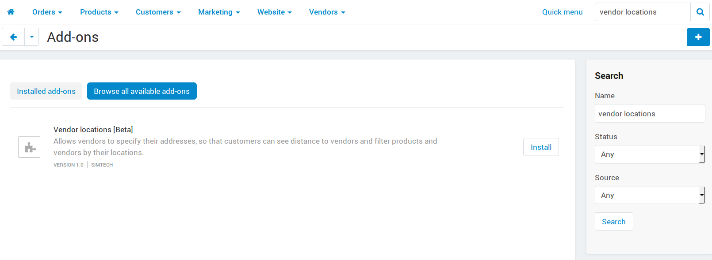
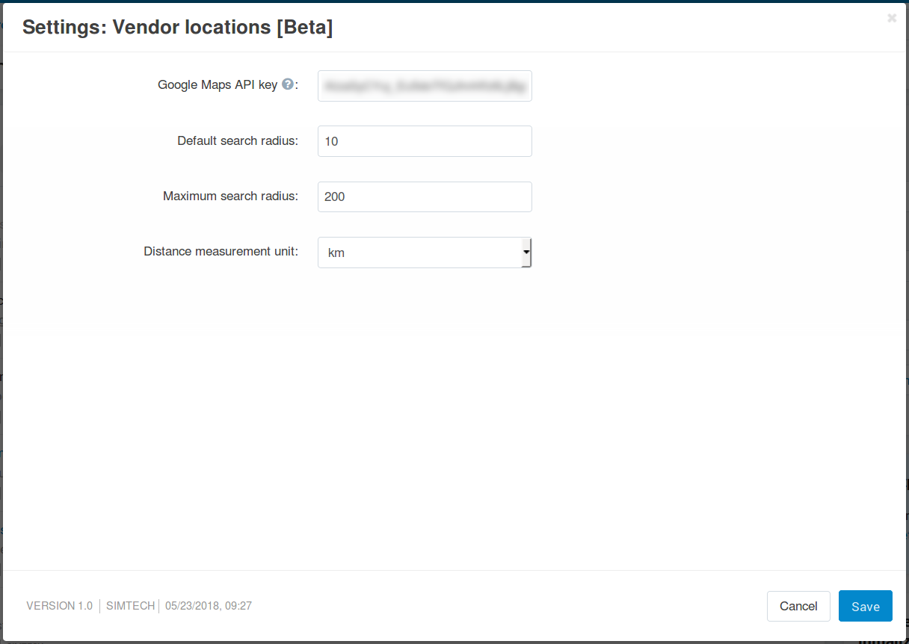
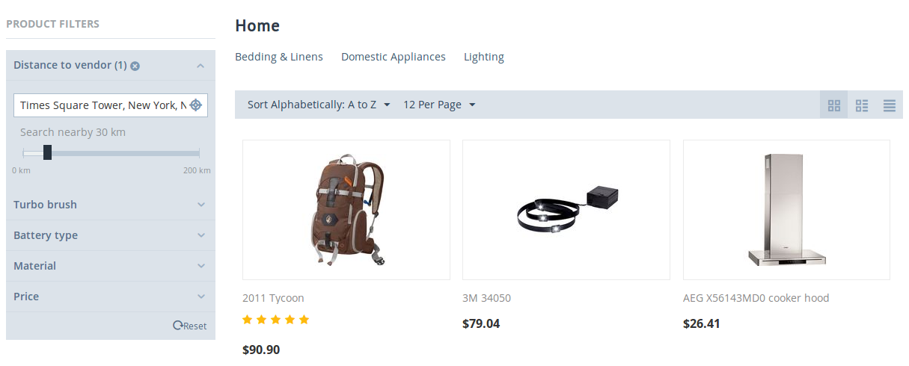

**************************************
How To: Set up Vendor Locations Add-on
**************************************

.. note::

    This add-on is exclusive in Multi-Vendor and first appeared in version 4.8.1.

The **Vendor locations [Beta]** add-on allows customers to select a location. This location is used for showing the list of nearby vendors and filtering products by distance. The add-on also provides a map of vendors, with the ability to filter vendors by city.

.. contents::
   :backlinks: none
   :local:

========================================
Step 1: Install and Configure the Add-on
========================================

By default, the add-on isn't installed. :doc:`Install it </user_guide/addons/1manage_addons>`, and you'll be able to access the add-on's settings by clicking on its name.

The add-on has the following settings:

* **Google Maps API key**—Google Maps calculate distance and show the locations of vendors. That's why you need to enter the Google Maps API key; get it by following `Google instructions <https://developers.google.com/maps/documentation/javascript/get-api-key>`_.

* **Default radius in distance filter**—the search radius that a product filter by distance will have by default.

* **Maximum radius in distance filter**—the maximum allowed search radius that a product filter by distance can have.

  .. note:: 

      The product filter that allows customers to search for products within a certain distance if they enter their location :ref:`needs to be added manually <mve-product-filter-by-distance>`. Otherwise the two settings above won't have any effect.

* **Distance measurement unit**—the measurement unit that will be used in product filters by distance and in the information about nearby vendors.

* **Vendors shown by default**—determines what vendors will be shown on the vendor list page (``dispatch=companies.catalog``) and on the map displayed on that page by default:

  * *All*

  * *From customer's city*

  * *From customer's country*

Once you've configured the settings, click **Save** to save your changes.

================================
Step 2. Specify Vendor Locations
================================

The add-on uses vendors' locations on Google Maps to calculate distance to vendors and show their positions on the map. That's why vendors need to enter their addresses; marketplace owners can also do that on vendors' behalf.

#. Go to **Vendors → Vendors**.

#. Click on the name of the vendor whose location you'd like to specify.

#. Find the **Location** field and start entering the address. If the add-on is configured properly, Google will automatically suggest possible addresses that you can select.

#. Once you have selected the address, click **Save**.

   .. image:: img/vendor_location_settings.png
       :align: center
       :alt: The location of a vendor as specified on the vendor's profile page.

=============================
Step 3. Set up the Storefront
=============================

Now that vendors' locations are specified, it's time to let the customers use the new functionality. For that, you'll need to add a few blocks and filters.

---------------------------
Add Location-Related Blocks
---------------------------

A :doc:`block </user_guide/look_and_feel/layouts/blocks/index>` is a part of a page that displays certain information or a control element. Below you'll find the list of blocks of the **Vendor Locations [Beta]** add-on that you can :doc:`add to the storefront </user_guide/look_and_feel/layouts/blocks/actions_on_blocks>`. When adding a block, you'll be able to find them on the **Create New Block** tab:

#. **Customer's location**—this block allows a customer to select his or her location, so that the distance to vendors could be calculated. The block displays the currently selected location; by clicking on it, customers summon a pop-up that allows to choose a different location.

   .. hint::

       For example, you can put this block it the **Top panel** or **Header** containers of the default :doc:`layout page </user_guide/look_and_feel/layouts/layout_pages/index>`. That way it'll be displayed on all pages.

#. **Closest vendors**—this block displays the vendors who are the closest to the customer's location. The distance to each vendor is calculated automatically by Google Maps. If the vendor is too close to the address chosen by the customer, *Nearby* will be displayed instead of the distance.

#. **Vendor map**—this block displays a Google Map with the locations of all vendors marked on it.

#. **Vendors by location**—this block is a filter for the map of vendors; it allows customers to choose a city, so that only vendors from that city would be displayed on the map.

   .. note::

       The **Vendor map** and **Vendors by location** blocks are automatically added to the list of vendors (``dispatch=companies.catalog``) after you install the add-on. If you'd rather not have them there, edit the *Vendors* layout page under **Design → Layouts**.

   .. image:: img/nearby_vendors_and_map.png
       :align: center
       :alt: The 4 blocks of the "Vendor Locations" add-on on one page.

.. _mve-product-filter-by-distance:

------------------------------
Add Product Filter by Distance
------------------------------

A :doc:`product filter </user_guide/manage_products/filters/index>` allows customers to limit the list of products displayed to them by certain criteria. The **Vendor Locations [Beta]** offers to choose a location and search for products within a specified distance from that location.

We have an article that describes :doc:`how to add a filter </user_guide/manage_products/filters/adding_filter>`. To create a filter by distance, make sure to set the **Filter by** property of the filter to *Distance to vendor*.

.. image:: img/distance_to_vendor_filter.png
    :align: center
    :alt: Filtering products by distance to vendor in Multi-Vendor.
