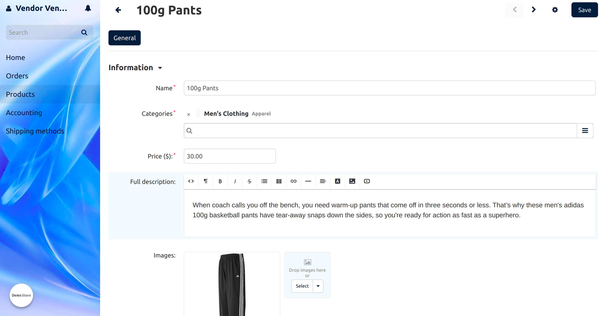

*************************
Vendor panel configurator
*************************

This add-on simplifies the vendor panel and allows administrators to manage the panel content and change its appearance.

.. contents::
    :local:
    :backlinks: none

=============
Functionality 
=============

Administrators can:

* manage product editing page in the vendor panel;
* customize vendor panel style.

Vendors get: 

* a simplified vendor panel that is easy to learn;
* only the necessary menu items and settings.

=============
Configuration
=============

The **Vendor panel configurator** is installed :doc:`like any other add-on </user_guide/addons/1manage_addons>`. Click the name of the installed add-on to open its settings.

The add-on settings are divided into two tabs: 

* **Product page settings**. Here, the administrator hides optional fields and tabs on the product editing page in the vendor panel.

  Names and positions of these settings are the same as :doc:`properties on the product editing page </user_guide/manage_products/products/product_attributes>`, so they are easy to navigate. Tick the checkboxes next to the fields and tabs that you want to show in the vendor panel. Some properties cannot be removed — they are the required ones. 

  .. note::

      There are also properties that are set globally for all products. To give a vendor permission to edit them, allow changing the property for individual items on the **Settings** page of the admin panel.

  .. image:: img/product_page_settings.png
      :align: center
      :alt: Product page settings in the "Vendor panel configurator" add-on.

* **Vendor panel style**. Here, the administrator customizes the appearance of the vendor panel. Configure the following settings:

  * **Element color**—choose a color for the following elements:

    * menu and working area;
    * inactive tabs;
    * background of active tabs;
    * icons.

  * **Sidebar color**—define the sidebar background color.

  * **Sidebar background image**—set your image for the sidebar background. The image is displayed instead of the sidebar color. We recommend you to choose a sidebar color that matches the background image.

  .. image:: img/vendor_panel_style.png
      :align: center
      :alt: Style sttings in the "Vendor panel configurator" add-on.

============
Menu changes
============

The vendor panel menu expands when the administrator installs some add-ons or changes settings in the admin panel. The menu changes and the corresponding add-ons and settings adding the changes after the activation, are listed below.

.. list-table::
    :header-rows: 1
    :widths: 30 30

    *   -   Add-on or setting
        -   Menu changes
    *   -   The **Message center** add-on
        -   The **Message center** link is added to the main menu.
    *   -   The **Product bundles** add-on
        -   The **Product bundles** link is added to the main menu.
    *   -   The **Call requests** add-on
        -   The "Orders" link is converted into a drop-down menu, and the **Call request** menu item is added there.
    *   -   The **Product reviews** add-on
        -   The "Products" link is converted into a drop-down menu, and the **Reviews** menu item is added there.
    *   -   The **Direct Customer-to-Vendor Payments** add-on
        -   The "Shipping Methods" link is converted into a drop-down "Settings" menu, and the **Payment methods** menu item is added there.
    *   -   The **Allow vendors to manage product features** setting on the *Settings → Vendors* page
        -   The "Products" link is converted into a drop-down menu, and the **Features** menu item is added there.
    *   -   The **Allow vendors to manage styles of the theme** setting on the *Settings → Vendors* page
        -   The "Shipping Methods" link is converted into a drop-down "Settings" menu, and the **Logos and styles** menu item is added there.
    *   -   The **Allow vendors to edit layouts** setting on the *Settings → Vendors* page
        -   The "Shipping Methods" link is converted into a drop-down "Settings" menu, and the **Page layouts** menu item is added there.

The default vendor panel menu contains the following items:

* Orders
* Products
* Accounting
* Shipping methods

