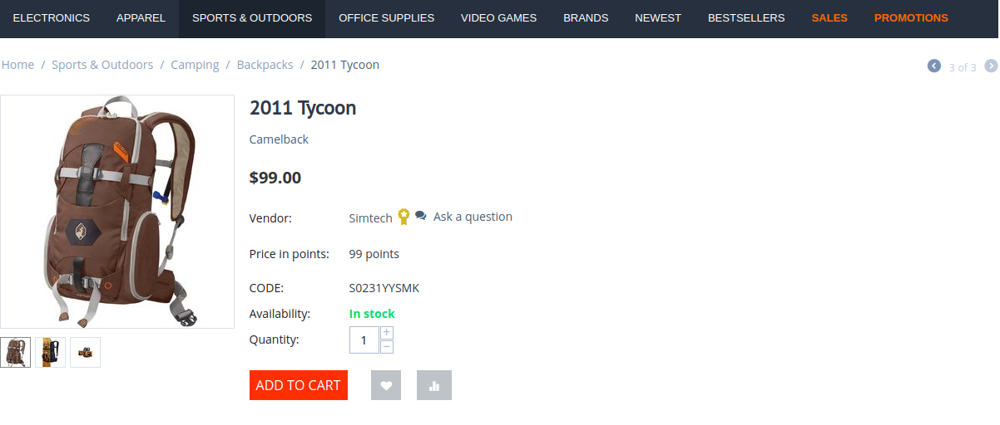

*************
Vendor Rating
*************

.. important::

    The Vendor rating add-on is only available for Multi-Vendor Plus and Multi-Vendor Ultimate users.

.. contents::
    :backlinks: none
    :local:
   
Features
========

The Vendor Rating add-on is a tool which allows marketplace owners to range vendors and theirs products.

Add the Ability to Sort by Rating
+++++++++++++++++++++++++++++++++

Give customers the ability to choose products by vendors' rating. The higher the rating, the higher the vendor or his products will be displayed in the list.

Specify Your Own Formula to Calculate the Rating
++++++++++++++++++++++++++++++++++++++++++++++++

The add-on allows the marketplace owner to make his own formula for calculating the rating of each vendor. The formula can consist of just one variable, or be a combination of several variables chosen by the marketplace owner himself.

Assign the Rating Manually
++++++++++++++++++++++++++

Let's say you want to bring the products of some vendor higher in the list, or increase the rating of vendors who use premium vendor plans. The add-on allows you to set some variables manually: You can do this:

* in the settings of any :doc:`vendor </user_guide/users/vendors/index>`;

* in the settings of any :doc:`vendor plan </user_guide/addons/vendor_plans/index>`.

By lowering or increasing the rating for certain vendors, the marketplace owner affects how their products are displayed on the storefront, and, therefore, has an influence on their sales.

Divide Your Vendors into Rating Levels
++++++++++++++++++++++++++++++++++++++

Depending on the vendors' rating, the add-on allows you to divide them into levels: bronze, silver and gold. It is displayed as an icon next to vendor's name.

Related articles:
=================

.. toctree::
    :titlesonly:
    :glob:

    configure

