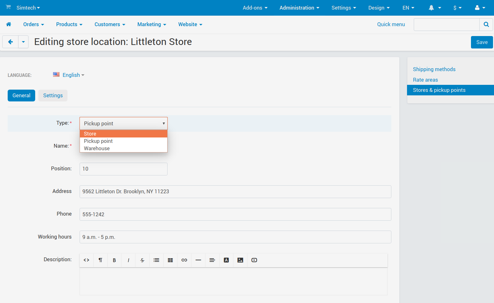
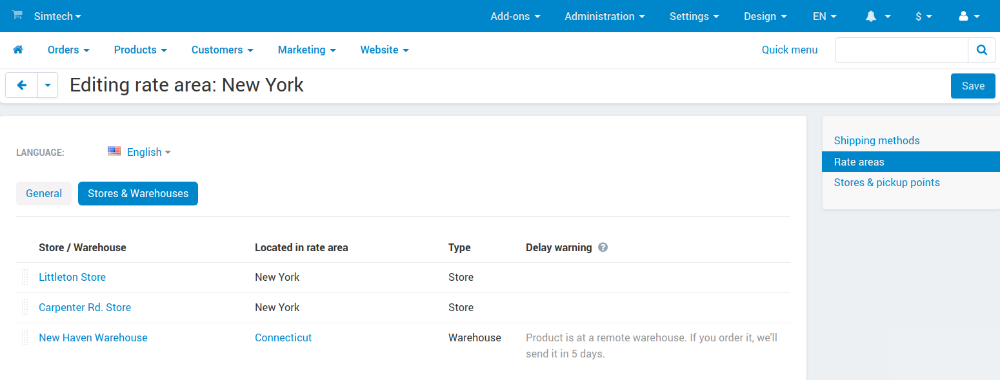
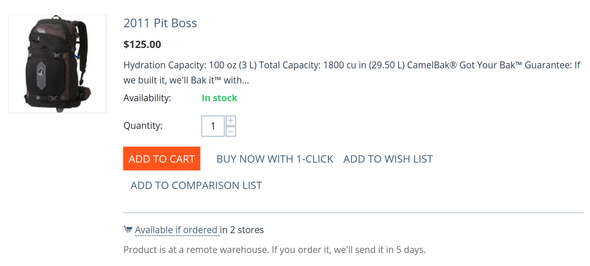

***********************************
FAQ: How Stores and Warehouses Work
***********************************

.. contents::
    :local:
    :backlinks: none

===================================
How to create a store or warehouse?
===================================

Stores and warehouses are based on pickup points. To create a warehouse, select a corresponding type :doc:`in the pickup point settings </user_guide/shipping_and_taxes/shipping_methods/realtime_shipping_methods/pickup>`: pickup point, store, or warehouse.

.. hint::
    First of all, make sure that the :doc:`index` add-on is :doc:`installed and active </user_guide/addons/1manage_addons>`. Otherwise you won't be able to select the type.

====================================================================
What's the difference between stores, pickup points, and warehouses?
====================================================================

.. list-table::
    :header-rows: 1
    :widths: 9 6 4 4

    *   -   
        -   Pickup point
        -   Store
        -   Warehouse
    *   -   Customers pick up orders here*
        -   ✓
        -   ✓
        -   
    *   -   It can appear on the product page
        -   
        -   ✓
        -   
    *   -   Products are stored here
        -   
        -   ✓
        -   ✓

\* This point can appear for "Pickup from store" shipping method and on the ``index.php?dispatch=store_locator.search`` map.

=================================================================
What do the settings of stores, warehouses, and pickup points do?
=================================================================

The pickup point editing page has the **Settings** tab. It allows you to set where the store/pickup point/warehouse is located, and the :doc:`rate areas </user_guide/shipping_and_taxes/locations/index>` it works with:

* **Located in**—where this point is located physically. For stores and pickup points, this setting determines the shipping time and charges if a customer decides to pick up product from there.

* **Show to** *(only for stores and pickup points)*—the rate areas where customers will see this store/pickup point and will be able to select it at checkout. 

  For example, if you have offline stores in New York and Connecticut, it makes sense to show only the relevant pickup points to the residents of each state.

* **Ship to** *(only for stores and warehouses)*—the rate areas where the products can be shipped from this store/warehouse.

  If a product is in stock only at a warehouse that doesn't ship to a rate area, then a resident of that rate area will see the product as out of stock.

  When a store or warehouse ships to a rate area, there are some extra settings:

  * **Moving time**—the time it takes to move a product from here to any store or warehouse in the rate area.

    .. important::

        If a rate area you ship to has at least one store (or you warn customers about delay), make sure to set a moving time for it. Otherwise customers won't know if a product is in stock, and how soon it will arrive.

    For example, if you have multiple stores located in New York, the setting determines how soon a product from this store or warehouse can arrive to any of them. That way, if a store doesn't have a product in stock, it will at least inform the customer how soon the product will arrive.

    The value you enter here can be a part of the following phrases:

    * *If ordered:* ``[value]``

    * *Product is at a remote warehouse. If you order it, we'll send it* ``[value]``.

      You can use values like ``in 3 hours``, ``tomorrow``, and so on. Or you can :doc:`change the phrases via language variables </user_guide/look_and_feel/languages/translate>`.

  * **Warn about delay**—show moving time on the product page, product list, and in the cart when a product needs to be shipped from this store or warehouse. 

    This checkbox helps when you work with a supplier who needs some time to get products to you. When you run out of products, and the supplier doesn't, customers will know that you'll need extra time before you can send the product.

.. image:: img/warehouse_settings.png
    :align: center
    :alt: The settings of stores and pickup points in CS-Cart.

============================================================
How many products can you buy when quantities are different?
============================================================

It depends on how you configure the warehouses and CS-Cart/Multi-Vendor. There are many possible combinations of settings: whether or not negative inventory and preorders are allowed, etc. That's why we'll only cover the basic principle of counting the available products here. There are two main scenarios.

**Scenario 1:** *Anyone can buy anything, regardless of where it is stored.* To make this scenario work, just make each of your stores and warehouses ship to all rate areas.

**Scenario 2:** *The available quantity depends on customer's location.* In this case, the available quantity will be determined by:

* Customer's rate area (retrieved either from the profile, or from geolocation).

* The quantity of products in the stores and warehouses that "Ship to" the rate area.

.. hint::
    For geolocation, we use GeoLite2 databases created by MaxMind, available from `https://www.maxmind.com <https://www.maxmind.com/>`_.

For example, see the picture below. The quantity of products from this store will be available in all existing rate areas, because the store ships to them all.

.. important::

    The available quantity is the sum of the quantities from all the stores and warehouses that ship to the rate area.

.. image:: img/warehouse_settings.png
    :align: center
    :alt: A warehouse that ships to all rate areas.

==============================================
How and where do I set quantity at warehouses?
==============================================

#. The :doc:`product editing page </user_guide/manage_products/products/add_product>` has the **Quantity** tab. It shows all the stores and warehouses, and lets you set quantities for them. There are 3 possible states:

   * *Any quantity other than 0*—the product is in stock at this store or warehouse.

   * *0*—the product is out of stock at this store or warehouse.

   * *No value*—this store or warehouse doesn't deal with the product.

   .. important::

       If a product has a set quantity (even 0) at any warehouse or store, then the general quantity won't be editable, and will be a sum of quantities. The old quantity (without distribution by stores and warehouses) will be preserved. It will return if you disable the :doc:`index` add-on or remove the quantities of this product from all warehouses.

   .. image:: img/warehouse_quantity.png
       :align: center
       :alt: Editing the quantity of products by warehouse.

#. The quantities at warehouses and in stores can be exported and imported.

   * When you :doc:`export products </user_guide/manage_products/import_export/product_export>` (or :doc:`create a data feed </user_guide/addons/data_feeds/create_df>`), the quantity of products at a specific warehouse or store will be available in a field like *[Store/warehouse name] (Warehouse)*.

   * When you :doc:`import products </user_guide/manage_products/import_export/advanced_product_import>`, you'll see the **Quantities** section in the **Fields mapping** tab. It has the names of stores and warehouses. That way you'll be able to import the quantities for different stores and warehouses.

========================================
Which warehouse are products taken from?
========================================

It depends on the settings of the :doc:`rate area </user_guide/shipping_and_taxes/locations/index>`, where the customer is located. Every rate area has its own priority for stores and warehouses on the **Stores & Warehouses** tab. Drag and drop stores and warehouses to change priority.

**Rule:** products are taken from the first store or warehouse that ships to *customer's rate area*. If some products from the order are missing there, then the remaining products or quantity will be taken from the second warehouse, and so on.

**Exception:** if a customer chooses to pick up products from a store, they will be taken from the selected store first. Missing products or quantity will be taken from stores and warehouses that ship to *the rate area of the selected pickup point*.

===========================================================
Why is there delay warning near some stores and warehouses?
===========================================================

The rate area editing page has a column called **Delay warning**. This warning will appear in the product list, on the product page, and in the cart next to a product. It will appear only if *all* the conditions below are met:

* A customer is from this rate area.

* The product is *out of stock* at all stores and warehouses that are higher in the list.

* The product is *in stock* at this warehouse or store.

* You've configured the store or warehouse to warn about delay when you have to move products from there to this rate area.

Delay warning appears on the rate area editing page to:

* Help you put stores and warehouses in correct order.

* Show how a warning will look, and what stores/warehouses make it appear.
