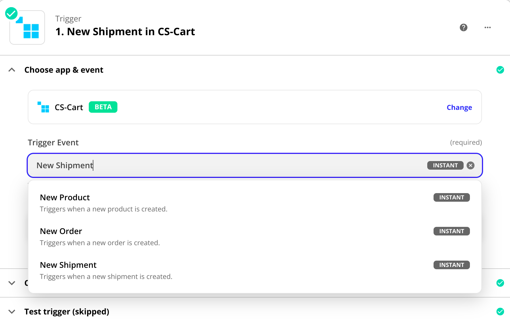

***********************
Integration with Zapier
***********************

In CS-Cart and Multi-Vendor 4.15.1, we have added an add-on that allows you to connect your store with a `Zapier platform <https://platform.zapier.com/quickstart/introduction>`_. Zapier allows you to integrate apps and services into workflows. This means that if you have a Zapier integration, you can embed an app that is missing in CS-Cart. When you link processes in the store to the work of other applications, you automate current tasks and save your time.

Set the rules for managing and exchanging data between the store and applications. These rules are called **Zaps**.

A Zap consists of one **trigger** (an event in CS-Cart or another app) and any number of **actions** set by the trigger. For example, creation of an order can be the trigger, meanwhile an action is sending an email about a new order and filling in a Google Sheet with order data.

.. note::

    Zapier provides `several plans <https://zapier.com/app/billing/plans>`_, including a free one. The price sets the number of created Zaps, Multi-step Zaps—the number of events that are activated by one trigger, etc.

.. contents::
   :backlinks: none
   :local:

============================================
How To: Set Up Store Integration with Zapier
============================================

#. Open the admin panel of your CS-Cart store, go to **Add-ons → Manage Add-ons** and make sure the **Integration with Zapier** add-on is installed and activated.

#. Go to the **Customers → Administrators** page. In the list of users, find the root administrator and open the profile page by clicking on their name. Give the administrator access to the API on the *API access* tab.

   .. note::

       Only the root administrator has access to the API. The root administrator account is automatically created during the installation of CS-Cart or Multi-Vendor. 

       Advanced versions of CS-Cart Multi-Vendor allow you to manage the API not only through the root administrator. For example, you can :doc:`create a user group and assign the necessary rights to it </user_guide/users/administrators/admin_group>`. Then add an administrator to the group to interact with the API and allow them to manage the API key.

   .. image:: img/add_connection.png
       :align: right
       :scale: 40 %
       :alt: Fields to fill in for access to Zapier.

#. Copy the existing API key. If you do not have a key, then generate a new one on the *API access* tab and copy it.

#. `Open your Zapier dashboard <https://zapier.com/app/dashboard>`_.
 
#. In the left side menu, click `My Apps <https://zapier.com/app/connections>`_ and choose **CS-Cart** as a custom integration: **Custom integrations → CS-Cart**.

#. Click the **Add connection** button and fill in the fields in the opened window:

   - **Username**—email address of the administrator who owns the API key.

   - **Password**—API key for store access. Paste the copied data.

   - **Base URL**—the full URL of the store without a slash at the end.

#. After entering the data, allow Zapier access to your store by clicking **Yes, continue**.

.. _zapier-connection-cs-cart:

8. Done! Now the *Connections* tab contains a note with your connection, like *CS-Cart (1.0.0) #1*.

9. Check if there is a connection. Open the menu next to the connection name and select **Test connection**.

   .. image:: img/list_of_connections.png
       :alt: Connection with CS-Cart in the list of connections.

========================================================================
How To: Integrate CS-Cart with a Service of Your Choice (Creating a Zap)
========================================================================

Follow these steps to automate the process that link the store with an app of your choice:

#. Activate the **Integration with Zapier** add-on in the admin panel and connect your store to Zapier.

#. In the Zapier dashboard, set up a **trigger**—an event that will launch your Zap.

   To do this, first select the app where the event will occur, then select the event itself.

   .. note::

      Select CS-Cart as the app if you want the trigger to be an event in the store, for example, a new product creation. Choose another app, like Google Sheets, to trigger actions when new rows appear in your sheet.

#. Set up an **action**—an event that the Zap performs after it starts.

   This step also includes selecting an app and setting up what will happen in that app.

   .. note::

      If you select CS-Cart as the application, then the trigger will produce changes in the store, for example, creating a new order .

#. Your Zap is ready.

   Now you can apply filters to add additional conditions for triggering the **action**. If you want to see the work of the created Zap, transfer the existing data from one app to another.

==========================
An Example of Creating Zap
==========================

Let's consider in detail how you can automate workflows via the example.

*Imagine that you need statistics on orders for several months. It will let you know who made the most orders, who spent the most money, which days had the most sales, etc. Google Sheets is a handy tool for creating such graphs and charts. If you want order data to appear regularly in the table, you need to transfer it from the store to the table.*

You can save time on routine processes by integrating with Zapier and creating Zaps. Let's create a Zap that will add information about new orders to the Google Sheet.

#. `Sign up <https://zapier.com/sign-up/>`_ or `login <https://zapier.com/app/login>`_ to your Zapier account and click the **Create Zap** button.

#. Сreate a **Trigger Event**.
    #. Select an app and an event. Then click **Continue**.

       **App event**—*CS-Cart*;

       **Trigger event**—*New Order*.

    #. **Choose account**. :ref:`The connection that was created when setting up the store integration with Zapier <zapier-connection-cs-cart>`.

    #. **Test trigger**. If everything was configured correctly, you will see the details of the last order from your store.

#. Create an **Action Event**.
    #. Select an app and an event.  Then click **Continue**.

       **App event**—*Google Sheets*;

       **Action event**—*Create Spreadsheet Row*.
   
    #. **Choose account**. The account that the Google Sheet is associated with.

    #. **Set up action**. :ref:`Customize data fields according to Google Sheets <zapier-spreadsheet_requirements>`. Click **Continue**.

    #. **Test action**. If everything was configured correctly, a new row with detailed information about the last order in the store will appear in your Google Sheet.

#. **Turn on Zap**.

   Your Zap is ready! Now data about new orders in your store will be automatically transferred to the Google Sheet. You can also create Zaps for other triggers and events.

.. image:: img/finished_zap.png
    :alt: Finished Zap with customized actions and triggers.

.. _zapier-spreadsheet_requirements:

Document Requirements
---------------------

Connect an existing Google Sheet or create a new one. To set up integration, your Google Sheet should contain:

* Column names;

  First row in Google Sheet with column names. In this case, your doc can contain columns like Order ID, user First and Last Name, Order Total etc.

* If your **trigger events** are in Google Sheets, then your need at least one row with filled data about the order/user/shipment from your store. This is necessary to test the correct setting of the Zap.

  *The example of Google Sheet*

  .. image:: img/example_speadsheet.png
      :alt: Screenshot of the table with the order details in the Google Sheets.

==========================================================================
What Events in CS-Cart Can Be Used to Connect with Other Apps and Services
==========================================================================

When you create a Zap, you set up triggers and actions. You can set events in your store to be the reason (trigger) for other events appearing. You can also make the store to be the place where events take place after the trigger fires. Only a few actions in the store can be built into this chain.

When choosing CS-Cart as an app, the following events can be triggers and actions:

.. list-table:: 
   :widths: 4 4 3 5
   :header-rows: 1

   * - 
     - Trigger
     - 
     - Action
   * - If CS-Cart launch a
     - * new order;
       * new product;
       * new shipment;
     - .. figure:: img/arrow.png
              :align: left
              :scale: 60%
              :alt: Arrow right.
     - Choose what happens after the store event is triggered. These can be events in CS-Cart or another app.

.. list-table:: 
   :widths: 6 3 3 6
   :header-rows: 1

   * - 
     - Trigger
     - 
     - Action
   * - If a trigger fired in CS-Cart or in another application, then
     - .. figure:: img/arrow.png
              :align: left
              :scale: 60%
              :alt: Arrow right.
     - the store performs
     - * creating an order;
       * creating a product.

.. meta::
   :description: How to set up integration with Zapier? What is Zapier integration for? How to integrate CS-Cart with an app of your choice?
