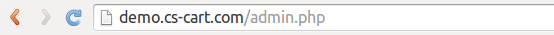
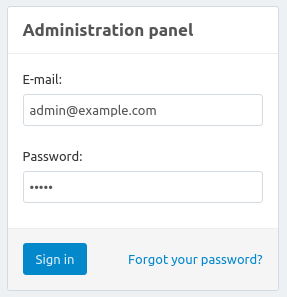
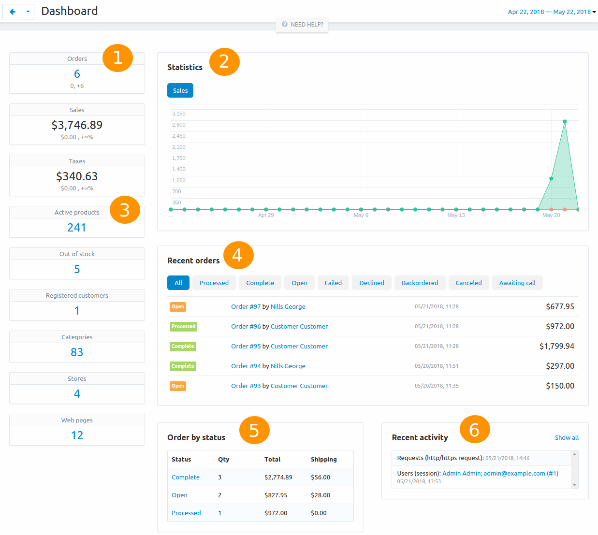
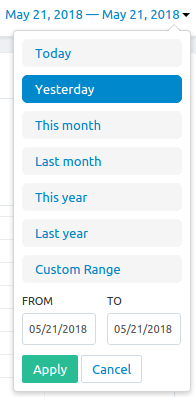
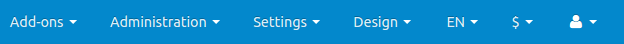
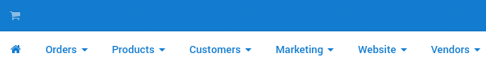

****************************************
Introduction to the Administration Panel
****************************************

The **Administration Panel** (or the admin panel for short) is the primary tool for you to work with your online store. Here you can manage products and orders, offer discounts, interact with your customers, change the look of your store and do much more.

.. note::

    Starting with version 4.7.3, you can use the **Responsive Admin Panel [Beta]** add-on to make tha Administration panel adapt to the screen size of your device. That way you can manage your store from mobile devices.

===========================
Connect to Your Admin Panel
===========================

To find the admin panel, open your online store’s website with a browser and add */admin.php* to the end of the URL.

.. important::

    If you already :doc:`installed CS-Cart <../install/index>` and :doc:`renamed admin.php <../install/security>` for security reasons, use the URL of your shop and **the new name of the admin.php file**, for example:

    *mynewshop.tk/my_admin_panel.php* 

For example, let's log in to the admin panel of the CS-Cart Online Demo (`demo.cs-cart.com <http://demo.cs-cart.com/>`_). Navigate to: `demo.cs-cart.com/admin.php <http://demo.cs-cart.com/admin.php>`_

Enter the administrator’s **email** and **password** that you used during CS-Cart installation. In CS-Cart Online Demo the email and password are already there for you, so all you have to do is click the **Sign in** button.

=============
The Dashboard
=============

The first thing you’ll notice is the **Dashboard**, where you can check sales statistics, view recent orders and product changes. The Dashboard also provides information from the database, such as the number of active products and registered customers.

1. Total number of orders, sales and taxes sums in your store.

2. Recent orders made in your store. Switch between the tabs to see orders with particular statuses.

3. Monthly statistics of your store in the form of a diagram.

4. Brief statistics of the store: the number of products, customers, pages, etc. Click on the number of items to go to the page with the detailed list of these items.

5. The number of orders with the particular status and total income received by the orders of this type.

6. Brief variant of information, represented in the **Administration → Logs** section. Click the **Show all** link to view the full log.

You can also choose the period of time, for which the information on the dashboard is displayed. Click on the period in the right upper corner of the page and choose the required period of time from the drop-down menu. Optionally, click **Custom Range** to define your own period and press **Apply**.

===========
The Top Bar
===========

Let’s take a look at the top bar:

*  **Add-ons**—manage useful extensions that add more features to your store
*  **Administration**—make backups of your store, import and export data, upgrade your store, edit your stores, payment and shipping methods, taxes and currencies
*  **Settings**—configure various aspects of your store, such as weight measurement units, sitemap, default language of the Admin Panel, and e-mail settings 
*  **Design**—edit your store’s menus, change the look of your store and the structure of certain types of pages.

The top bar also lets you select the language of the admin panel and the currency to use on the Dashboard and in sales reports.

The **cart icon** on the left side of the top bar allows you to go to the storefront. The storefront is what your customers see when they open your store. 

You can control multiple stores from one admin panel. Click the name of the store near the cart icon and select the store, or press **Manage stores** to edit your stores and add new ones.

.. note::
    Unless you use CS-Cart Ultimate, you’ll need to `purchase additional storefront licenses <http://www.cs-cart.com/cs-cart-storefront-license.html>`_, if you want to manage multiple stores with one Administration panel. You can also specify the desired number of storefronts when you `buy a CS-Cart license <http://www.cs-cart.com/cs-cart-license.html>`_.

================
Store Operations
================

The panel below the top bar serves to manage the operations of your store:

*  The **home icon** takes you to the Dashboard
*  **Orders**—view sales reports and manage your orders and shipments
*  **Products**—edit products and their categories, features, filters, and options
*  **Customers**—manage the store’s administrators and registered customers, as well as user groups with different privileges
*  **Marketing**—promote your products, offer bonuses, and view the carts that the customers didn’t take to checkout
*  **Website**—create and publish pages, polls, forms and links, as well as to manage the `SEO <https://en.wikipedia.org/wiki/Search_engine_optimization>`_ aspects of your store.

.. note::

    Your Admin Panel may have additional menu subsections, depending on the add-ons you installed and activated.

