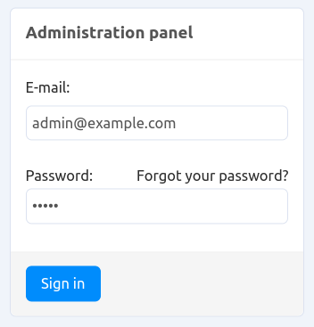
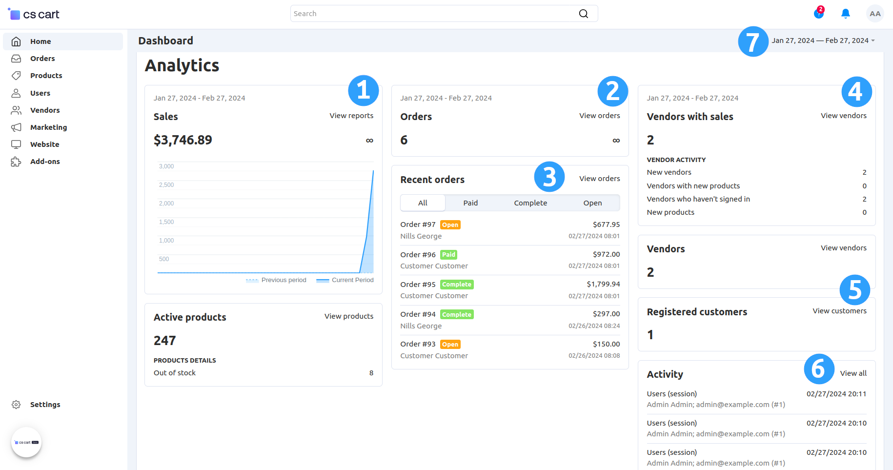
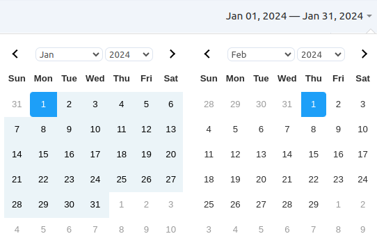
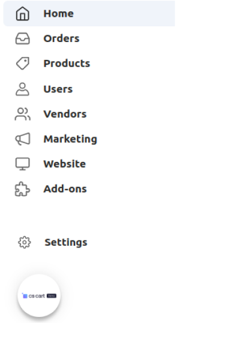
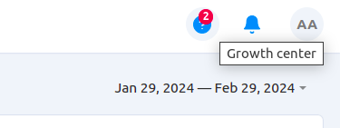

****************************************
Introduction to the Administration Panel
****************************************

The **Administration Panel** (or the admin panel for short) is the primary tool for you to work with your online store. Here you can manage products and orders, offer discounts, interact with your customers, change the look of your store and do much more.

The admin panel is responsive: it adapts to the screen size of the device you view it from. That way, you can manage your store from mobile devices.

===========================
Connect to Your Admin Panel
===========================

To find the admin panel, open your online store’s website with a browser and add */admin.php* to the end of the URL.

.. important::

    If you already :doc:`installed CS-Cart <../install/index>` and :doc:`renamed admin.php <../install/security>` for security reasons, use the URL of your shop and **the new name of the admin.php file**, for example:

    *mynewshop.tk/my_admin_panel.php* 

For example, let's log in to the admin panel of the CS-Cart Online Demo (`demo.cs-cart.com <http://demo.cs-cart.com/>`_). Navigate to: `demo.cs-cart.com/admin.php <http://demo.cs-cart.com/admin.php>`_

.. image:: img/intro/url.png
    :align: center
    :alt: The URL of the admin panel in CS-Cart Onlide Demo.

Enter the administrator’s *email* and *password* that you used during CS-Cart installation. In CS-Cart Online Demo the email and password are already there for you, so all you have to do is click the **Sign in** button.

=============
The Dashboard
=============

The first thing you’ll notice is the **Dashboard**, where you can check sales statistics, view recent orders and product changes. The Dashboard also provides information from the database, such as the number of active products and registered customers.

#. Monthly statistics of your store in the form of a diagram with a sales reports link.

#. Total number of orders for a current period.

#. Brief statistics of the store's recent orders. Switch between the tabs to see orders with particular statuses. Click on the **View all** to go to the page with the detailed list of orders.

#. Brief vendors activity statistics: new vendors, new products, etc. Click on the **View all** links to go to the page with the detailed list of vendors.

#. Vendors and registered customers quantity statistics. Click on the **View vendors** or **View customers** links to go to the page with the detailed lists. 

#. Brief variant of information, represented in the **Settings → Logs** section. Click the **View all** link to view the full log.

#. You can also choose the period of time, for which the information on the dashboard is displayed. Click on the period in the right upper corner of the page and choose the required period of time from the drop-down menu. Optionally, click **Custom Range** to define your own period.

============
The Side Bar
============

Let’s take a look at the side bar:

*  **Home**—takes you to the Dashboard page of your store.

*  **Orders**—view sales reports and manage your orders and shipments, view the carts that the customers didn’t take to checkout.

*  **Products**—edit products and their categories, features, filters, and options.

*  **Users**—manage the store’s administrators and registered customers, as well as user groups with different privileges.

*  **Vendors**—(available only in Multi-Vendor)—manage vendors in your marketplace and control your accounting.

*  **Marketing**—promote your products with product bundles, offer bonuses and gift certificates, manage newsletters.

*  **Website**—configure the theme of the store, manage pages, blog, menu and tags. Set the SEO rules, review comments and create a sitemap.

*  **Add-ons**—manage useful extensions that add more features to your store.

*  **Settings**—configure various aspects of your store, such as: payment and shipping methods, taxes and currencies. Import and export the data, back up your site, manage accounts and profile fields, upgrades, texts and languages of your store. Create a new storefront and configure it on the Storefronts tab.

=============
Growth center
=============

The **Growth center** button located in the upper right corner is a way to get acquainted with your CS-Cart store. This tool is very useful for begginers, who may find it difficult to find relevant information that they need to start selling. When you open the Growth Center on any page in the store, such as Products, Orders, Vendors, or any other page, it will provide corresponding articles in documentation, videos, add-ons and other resources.

Relevant info
=============

This section contains three topics: Documentation, Videos and Add-ons and themes. 

* The **Documentation** section has links to all of the relevant articls you might need to configure your store and get to know the CS-Cart functionality. The contents of the Documentation section depends on the page you open it. For example, if you open it on the Products page, it will display all articles related to product management.

 .. image:: img/intro/growth_center_documentation.png
    :align: center
    :alt: The Documentation section of a Growth center on a Dashboard.

* The **Videos** section suggests quick video guides, selected for each page. For example, when you open the Growth Center on the Orders page and click on the Videos section, you will be presented with videos on that specific topic—Orders.
    
* The **Add-ons and themes** section suggests you relevant add-ons depending on the page you open it. Themes are suggested on the Dashboard page of the store. 

    
Help
====

This section contains a Quick start guide and Ask us a question parts.

* The **Quick start guide** part contains a couple of useful videos for beginners. 
* The **Ask us a question** part allows to contact our Customer Care team and view your recent tickets. 

Resources
=========

* The **What's new** section presents recent updates in CS-Cart. 
* The **Community** takes you to our CS-Cart Forum. 
* The **Marketplace Academy** is a course where we share our expertise on how to start and run marketplaces.
* The **Blog** takes you to the homepage of our blog.

.. meta::
   :description: Where to find CS-Cart or Multi-Vendor admin panel? How to work with CS-Cart or Multi-Vendor admin panel?
