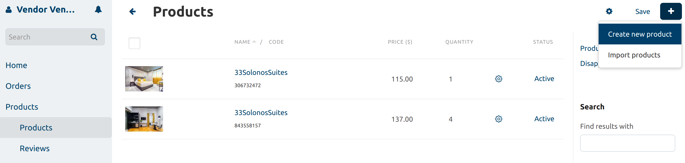
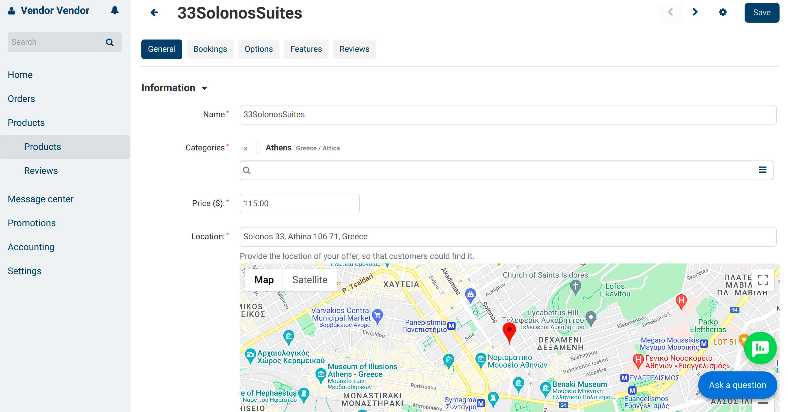
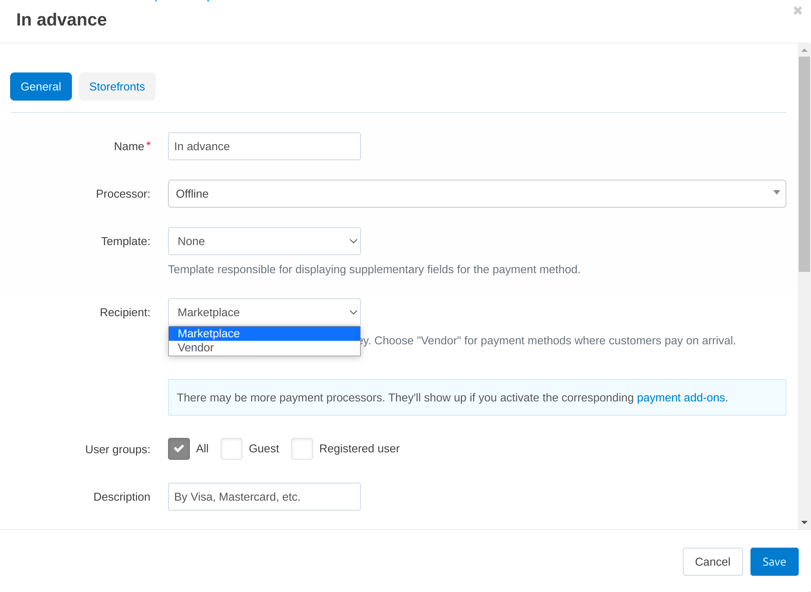

*******
Booking
*******

With CS-Cart Multi-Vendor Booking, you can build your own online booking business. Here's what it might look like:

* Property owners (vendors) register on your site and create products—their offers of housing for rent. 

* Customers specify the place and date of stay, choose the appropriate offer and book it.

* You, as an administrator, approve or disapprove property owners, decide what they can or can't do, decide whether customers pay through the marketplace or to vendors, communicate with your vendors and customers, and much more.

Let's look at the implementation of these scenarios from the technical side.

.. contents::
   :backlinks: none
   :local:

=======================
How Hosts Create Offers
=======================

To rent out a property, go to the **Products → Products** page and click on the **+** button in the upper right corner. The page with the main object properties will open.

Here the vendor sets the **name** of their offer, chooses the **location** on the map (:doc:`enable Google Maps through the Vendor Location add-on </user_guide/addons/vendor_locations/configure>`), sets the **price** per night, and uploads :doc:`images </user_guide/look_and_feel/logos_banners_images/images_for_store>` and **description**.

If a vendor has multiple similar accommodations (for example, hotel rooms or houses), then the **"In stock"** determines how many accommodations of this type a vendor can offer. Vendors can also decide which :doc:`Taxes </user_guide/shipping_and_taxes/taxes/index>` will be applied to the product.

After clicking the **Save** button, the product will be :doc:`sent for moderation </user_guide/addons/vendor_data_premoderation/index>` to the marketplace owner and then can appear on the storefront. At the same time, additional tabs with properties will appear on the product editing page. :doc:`Most of them are described elsewhere </user_guide/manage_products/products/product_attributes>`, so we'll only cover the important ones here.

The calendar on the *Bookings* tab allows the vendor to find out:

* which days are free/not available for booking,

* which days the accommodation was booked for.

Here, the vendor also can set a date range that needs to be unavailable.

:doc:`Options </user_guide//manage_products/options/index>` allow vendors to offer customers additional daily services, such as breakfasts or dinners. 

:doc:`Features </user_guide/manage_products/features/index>` let vendors add inherent facilities, such as TV, Wifi, parking, pet-friendly etc. Specifying these features helps customers find the right accommodation. You as the marketplace owner create features, and vendors choose the ones which apply to their offers.

.. _booking-faq-variations:

:doc:`Variations </user_guide/manage_products/products/product_variations>` allow vendors to create different variants of the same room. For example, it can be a Standard hotel room and variants for it—Superior and Lux rooms.

The :doc:`Reviews </user_guide/addons/comments_and_reviews/index>` tab helps vendors to interact with their customers. Here they can view and edit customers’ reviews of the product and reply to commentators.

There can be more tabs and properties on the product page. The appearance of some tabs and settings may depend on different things:

* Marketplace owner manages product page settings using the `"Vendor panel configurator" <https://www.youtube.com/watch?v=NyOCHOUI1vU&ab_channel=CS-Cart>`_ add-on. 

* Some fields appear depending on what settings the administrator has configured on the :doc:`Settings </user_guide/settings/index>` page. 

* Some product tabs are a part of add-ons, so they appear if the add-on in the admin panel is active. This applies, for example, to the *Variations* tab, which is part of the :doc:`/user_guide/addons/product_variations/index` add-on functionality. 

================================
How Customers Book Accommodation
================================

#. A customer comes to your site in search of a rental property. The main search parameters are the object location and the dates of arrival and departure.

   .. note:: 

       You can configure how well in advance a customer can book a property, and the maximum length of a booking on the **Settings → Checkout** page.

   .. image:: img/location_date.png
       :align: center
       :alt: The customer is searching for suitable housing by the object location and dates of arrival and departure.

#. The customer receives the list of objects in the right place for the required dates. Now they can filter offers by price and product features, such as type (apartment, hotel, guesthouse, etc.) or facilities (such as parking or TV). 

   .. note:: 

       Usually, you as the marketplace administrator create such :doc:`features </user_guide/manage_products/features/product_features>` in advance, and vendors apply them to their products. But you can :doc:`allow vendors to create their own custom features </user_guide/manage_products/features/vendor_features>`, if necessary.

   .. image:: img/filters.png
       :align: center
       :alt: The customer is searching for suitable housing using filters.

#. On the offer page, the customer can:

   * read the reviews of the previous tenants;

   * contact the marketplace or the property owner to ask questions;

   * choose additional services, such as breakfast and lunch (administrators create them as :doc:`options </user_guide/manage_products/options/index>`).

   .. image:: img/offer_page.png
       :align: center
       :alt: The customer is on the product detail page.

#. After the customer clicks the **Reserve** button, the checkout page opens for them. There they need to fill in the basic information about themselves and choose a payment method. By default, they can choose to pay on arrival or in advance. 

   * If the customer chooses to pay in advance, the money will go to your marketplace first. The vendor’s share will be recorded, and you’ll have to pay it to them somehow. CS-Cart has the means for you to do it automatically (through :doc:`Stripe Connect </user_guide/addons/stripe_connect/index>` and :doc:`PayPal Commerce Platform </user_guide/addons/paypal_commerce_platform/index>`). When these means are set up, a certain percentage of the payment goes to the vendor.

   * If the customer chooses to pay on arrival, they will pay in person,  directly to the host. In this case, the vendor must pay the prescribed percentage to the marketplace.

   After choosing the payment method, the customer places an order. Now the administrator and the property owner can view this order on the **Orders → View Orders** page.

   .. image:: img/checkout.png
       :align: center
       :alt: The customer is finishing booking.

=======================
How To: Manage Bookings
=======================

The **Orders → Bookings** page shows administrators a list of offers on the marketplace. The Vendors will see all of their own properties there.

On this page you can:

* Find out info about :ref:`all the variants <booking-faq-variations>` of objects existing on the marketplace and view their availability for a specific date. 

* See what objects are available on the selected dates by specifying the dates within the calendar.

* If the item is available, then you can quickly book accommodation for the necessary dates by clicking the **Reserve** button . It's useful, for example, if a client has requested a reservation by phone.

* If the item is not available, then you can just view all the bookings for the specific dates by clicking the link under the availability status. 

  .. image:: img/bookings.png
      :align: center
      :alt: The Orders → Bookings page.

===================================================
How To: Let Customers Pay in Advance and on Arrival
===================================================

CS-Cart Multi-Vendor allows you to :doc:`distribute money between vendors and the marketplace in different ways </user_guide/users/vendors/workflow>`. CS-Cart Multi-Vendor Booking uses different money distribution schemes depending on how customers paid for the reservation:

* When a customer decides to pay for an object in advance, the money first goes to the marketplace owner. After the successful booking, the built-in tools calculate the necessary part of the vendor revenue and transfer it to them. 

* When a customer decides to pay on arrival, the money first goes to the vendor. The vendor must transfer to the marketplace a percentage of this payment by himself.

To enable customers to pay for accommodation when making a booking, the marketplace owner creates payment methods on the **Administration → Payment methods** page. Vendors cannot create their own payment methods.

To create a payment method, go to the above page in the admin panel, click the **+** button in the top right corner of the page. :doc:`There are a few fields to fill in </user_guide/payment_methods/configure_payment>`, and most of them are self-explanatory. But these are the main ones:

**Recipient**—the party that initially gets the money. 

* Choose *Vendor* as the recipient for payment methods like “Pay on arrival”. It means that the vendor will get the money and will owe the marketplace its share. :doc:`CS-Cart has mechanisms to collect money from vendors </user_guide/addons/vendor_debt_payout/index>`.

* Choose *Marketplace* as the recipient for payment methods like “Pay in advance”, where the money goes through the marketplace somehow. When Recipient is set to *Marketplace*, the additional fields appear. It is one of them:

**Processor**—the payment system that will process the payments made through this payment method. For example, you can choose PayPal, if you want to receive money via this system and then pay the vendors’ share when they request it. Or you can use Stripe Connect or PayPal for Marketplaces to have the vendors connect their accounts and receive their share automatically.

:doc:`How Property Owners Become Vendors </user_guide/users/vendors/allow_customers_to_apply_for_vendor_account>`

.. meta::
   :description: FAQ about booking for Multi-Vendor marketplace: functionality, customization.
