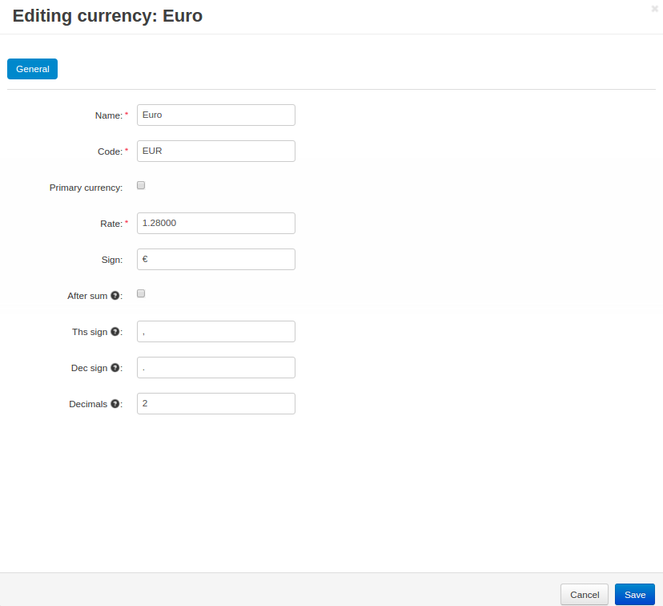

**********
Currencies
**********

Edit the currencies of your store under **Administration → Currencies**.

As a rule, multiple currencies serve to display prices on the storefront. Payments are usually accepted in the store primary currency only. 

However, if your payment gateway is configured to accept payments in different currencies, customers who use this gateway will be charged in an alternative (not primary) currency. 

The order total will be calculated according to the store currency exchange rate that you define here.

.. important::

    All prices you enter in the Administration panel are assumed to be in the primary currency. CS-Cart & Multi-Vendor use primary currency for all calculations. When necessary, the results of those calculations are converted to the selected currency according to the specified exchange rate.

.. image:: img/currencies.png
    :align: center
    :alt: Your store can have several currencies.

===================
Currency Properties
===================

-------
General
-------

* **Name**—the name of the currency as it appears on the storefront (USD, Euro, etc.)

* **Code**—the unique code of the currency.

* **Primary currency**—the primary currency of your store.

* **Rate**—the exchange rate to convert store prices and costs from the primary currency to this currency. 

  In the example above, the primary currency is the American dollar, and the values in the **Rate** field define, how many dollars there are in one Euro and in one British pound.

* **Sign**—the currency symbol.

* **After sum**—if you enable this setting, the currency symbol will appear after the price. Otherwise, it will appear before the price.

* **Ths sign**—the symbol that separates thousands.

* **Dec sign**—the symbol that serves as the decimal mark.

* **Decimals**—the number of digits after the decimal mark.

* **Status**—currency status: 

  * **Active**—the currency is available on the storefront.

  * **Disabled**—the currency is not available on the storefront.

-----
Share
-----

.. note::

    The **Share** tab appears only if you have multiple storefronts.

If you :doc:`manage multiple stores with one Administration panel <../stores/index>`, you can select the storefronts where the currency will be available. This is done via sharing. :doc:`Learn more about sharing objects among stores <../stores/sharing>`.

.. important::

    The primary currency always appears in the currency selection menu in the Administration panel, even if it isn't shared with the storefront you're working with. This is because all calculations are done in the primary currency.

.. image:: img/select_currency.png
    :align: center
    :alt: The primary currency always appears in the Administration panel's currency selector.
